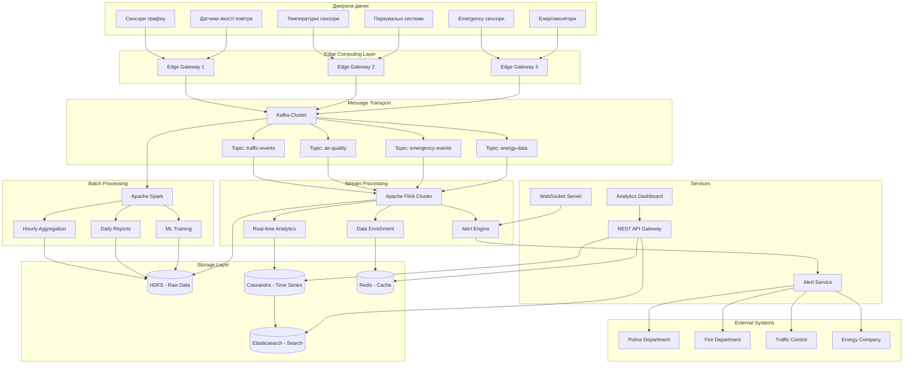
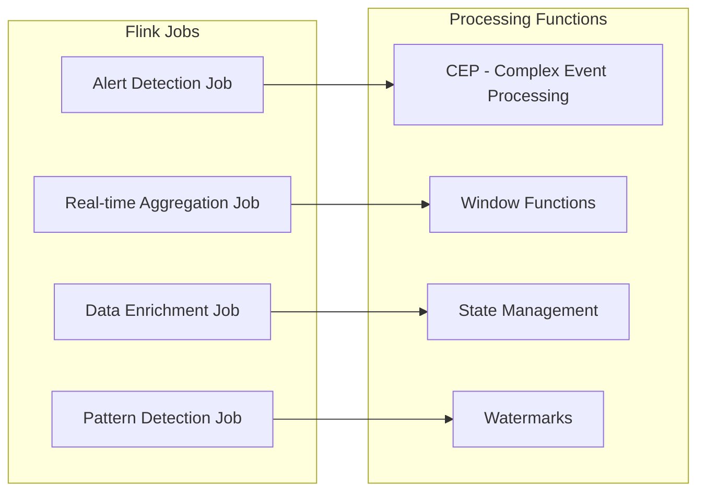
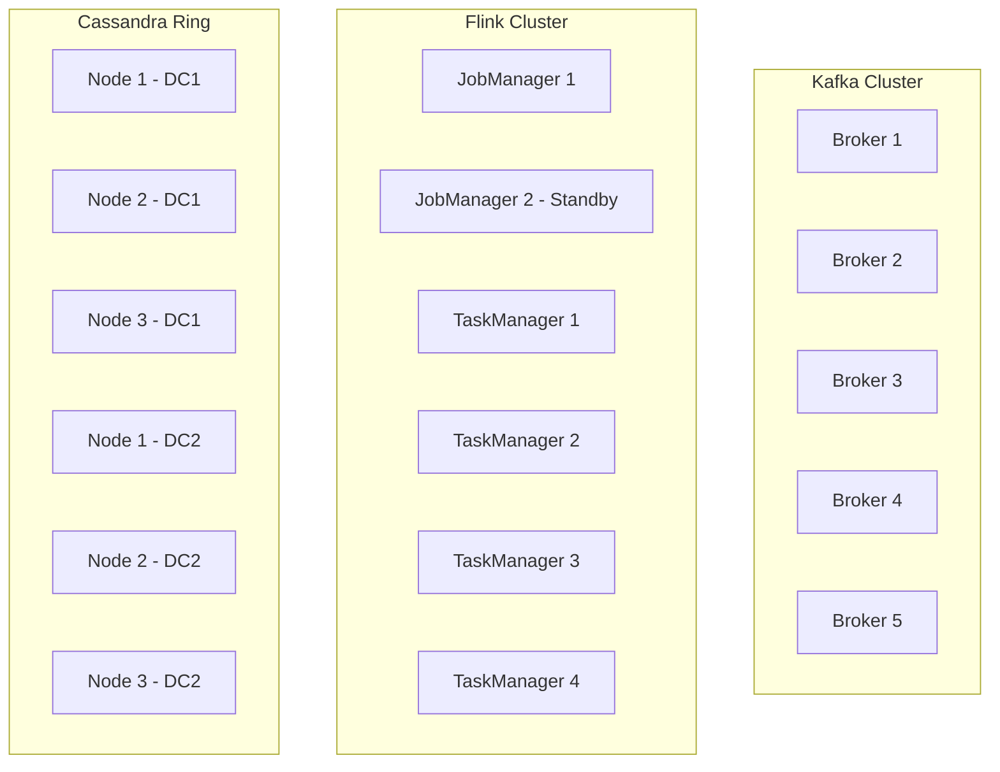
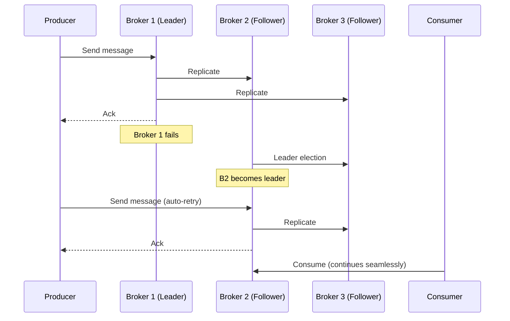
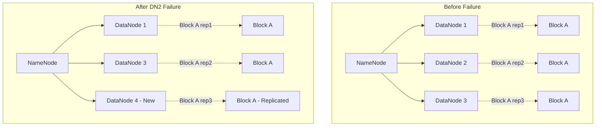
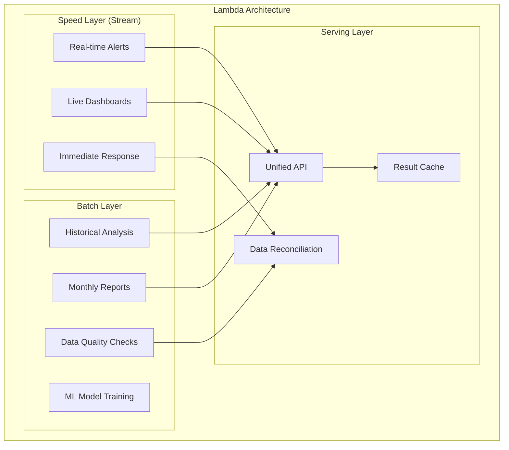

# Архітектура системи «Розумного міста»

## Зміст
1. [Архітектура системи](#архітектура-системи)
2. [Гарантії обробки](#гарантії-обробки)
3. [Відновлення після збоїв](#відновлення-після-збоїв)
4. [Випадки використання](#випадки-використання)

## Архітектура системи

### Загальна архітектурна схема



### Детальний опис компонентів

#### Джерела даних
- Сенсори трафіку - швидкість, кількість, щільність потоків
- Датчики якості повітря - CO₂, PM2.5, озон та інші забруднювачі
- Температурні сенсори - дані від температурних сенсорів для кліматичного моніторингу. 
- Паркувальні системи - події паркувальних систем (зайняття/звільнення місць).
- Аварійні сенсори - події спостережувальних систем пожежі, витоки газу, НС
- Енергомонітори - показники лічильників споживання електроенергії

#### 1. Edge Computing Layer
**Apache NiFi** автоматизує потоки даних, що забезпечує збір, маршрутизацію і трансформацію даних між різними системами. На периферійних шлюзах виконує:
- Первинну фільтрацію та валідація даних
- Локальне кешування при відсутності зв'язку
- Компресію та групування повідомлень для оптимізації мережевого трафіку

**Розподіл периферійних шлюзів:**
- **Edge Gateway 1**: Обробляє дані від сенсорів трафіку та датчиків якості повітря в центральних районах міста
- **Edge Gateway 2**: Збирає дані від температурних сенсорів та паркувальних систем у житлових районах
- **Edge Gateway 3**: Відповідає за критичні системи - аварійні сенсори та енергомонітори для швидкого реагування

#### 2. Message Transport (Apache Kafka)
**Kafka** виступає як центральна шина подій системи, забезпечуючи надійну доставку повідомлень між компонентами. кожен топік оптимізований під специфічні потреби:

- **traffic-events**: Найбільше навантаження (12 розділів), коротке зберігання (7 днів)
- **air-quality**: Середнє навантаження, довше зберігання (30 днів) для екологічного аналізу
- **temperature-data**: Середнє навантаження - 4 розділи (4 квартали), подовжене зберігання - 90 днів (для сезонного аналізу)
- **parking-events**: Середнє навантаження - 6 розділів, коротке зберігання - 14 днів (швидкозмінні дані)
- **emergency-events**: Мінімальні розділи але максимальне зберігання (365 днів) для аудиту
- **energy-data**: Збалансована конфігурація для енергетичних показників

Коефіцієнт реплікації = 3 забезпечує відмовостійкість при виході з ладу до 2 брокерів.
```yaml
# Конфігурація Kafka топіків
topics:
  traffic-events:
    partitions: 12
    replication-factor: 3
    retention: 7d
    
  air-quality:
    partitions: 6
    replication-factor: 3
    retention: 30d

  temperature-data:
    partitions: 4
    replication-factor: 3
    retention: 60d

  parking-events:
    partitions: 6
    replication-factor: 3
    retention: 14d
    
  emergency-events:
    partitions: 3
    replication-factor: 3
    retention: 365d
    
  energy-data:
    partitions: 8
    replication-factor: 3
    retention: 90d
```

#### 3. Stream Processing (Apache Flink)
**Apache Flink** забезпечує потокову обробку даних у реальному часі з низькою затримкою. Різні завдання обробляють специфічні типи подій:

- **Alert Detection Job**: Виявляє критичні ситуації (перевищення CO₂, аварії) через CEP патерни
- **Real-time Aggregation Job**: Обчислює статистики у часових вікнах (середня швидкість трафіку за 5 хвилин)
- **Data Enrichment Job**: Збагачує дані контекстною інформацією (погодні умови, час доби)
- **Pattern Detection Job**: Знаходить складні закономірності поведінки (аномалії в енергоспоживанні)

Функції обробки забезпечують підтримку стану, обробку запізнілих подій через часові мітки (watermarks) та віконні агрегації.


#### 4. Batch Processing (Apache Spark)
**Apache Spark** обробляє великі обсяги даних у пакетному режимі для поглибленого аналізу та звітності. Різні завдання виконують специфічні функції:

- **Hourly Aggregation**: Створює годинні зведення даних (середні показники трафіку, енергоспоживання)
- **Daily Reports**: Формує щоденні звіти для міських служб (статистика паркування, якість повітря)
- **ML Training**: Навчає моделі машинного навчання на історичних даних для прогнозування
- **Data Quality Checks**: Валідує цілісність даних та виявляє аномалії в історичних записах

Spark оптимально використовує ресурси кластера в нічний час, коли навантаження на потокову обробку мінімальне.

#### 5. Storage Layer

**HDFS (Hadoop Distributed File System):**
- Розподілена файлова система для зберігання великих обсягів даних
- Довгострокове зберігання необроблених даних від всіх сенсорів міста
- Розділення по датах: `/data/year=2025/month=10/day=10/hour=14/`
- Відмовостійкість через реплікацію блоків на кілька вузлів (RF=3)
- Оптимізована для пакетної обробки великих файлів Apache Spark

**Apache Cassandra:**
- NoSQL база даних для зберігання часових рядів сенсорних даних
- Високоефективні записи та читання для великих обсягів IoT даних
- Розподілена архітектура без єдиної точки відмови
- Оптимізована для запитів за часовими періодами та локацією
- Автоматичне розподілення даних по вузлах кластера (RF=3)
```cql
-- Схема для time-series даних
CREATE TABLE sensor_data (
    sensor_id text,
    location text,
    timestamp timestamp,
    event_type text,
    value double,
    metadata map<text, text>,
    PRIMARY KEY ((sensor_id, location), timestamp)
) WITH CLUSTERING ORDER BY (timestamp DESC);
```

**Elasticsearch:**
- Індексація для швидкого пошуку
- Агрегації для дашбордів
- Геопросторові запити

**Redis:**
- Високошвидкісний кеш для часто використовуваних даних
- Зберігання результатів обчислень Flink в реальному часі
- Сесії користувачів та тимчасові дані дашбордів
  
Redis доповнює архітектуру зберігання як швидкий кеш між потоковою обробкою та клієнтськими додатками, забезпечуючи низьку латентність для інтерактивних запитів.

### Обґрунтування вибору технологій

**Apache Kafka проти RabbitMQ/ActiveMQ:**
- Висока пропускна здатність (понад 1 мільйон повідомлень на секунду)
- Довготривале зберігання подій для повторного відтворення
- Горизонтальне масштабування через розділення на частини (partitioning)
- Підтримка гарантій одноразової доставки (Exactly Once) з Flink

**Apache Flink проти Apache Storm/Spark Streaming:**
- Справжня потокова обробка (не мікропакетна)
- Низька затримка (менше 100 мілісекунд) критична для аварійних сповіщень
- Вбудована підтримка часу подій та часових міток
- Гарантії одноразової обробки (Exactly Once) через механізм контрольних точок

**Apache Spark проти Hadoop MapReduce:**
- У 10-100 разів швидша обробка завдяки обчисленням у пам'яті
- Уніфікований інтерфейс для пакетної обробки, потоків, машинного навчання та запитів
- Оптимізований для складних аналітичних запитів
- Інтеграція з Delta Lake для транзакційних гарантій

**Cassandra проти MongoDB/PostgreSQL:**
- Лінійне масштабування для інтенсивних операцій запису IoT пристроїв
- Оптимізована для часових рядів з автоматичним терміном життя
- Децентралізована архітектура без єдиної точки відмови
- Висока доступність у географічно розподілених центрах обробки даних

**HDFS проти Amazon S3/Azure Blob:**
- Локальне зберігання для вимог відповідності міської адміністрації
- Інтеграція з екосистемою Hadoop (Spark, Hive)
- Нижча вартість довгострокового зберігання
- Контроль над даними без прив'язки до постачальника

**Redis проти Memcached/Hazelcast:**
- Підтримка складних структур даних (відсортовані множини, хеш-таблиці)
- Збереження даних на диску через механізми резервного копіювання
- Можливості публікації/підписки для сповіщень у реальному часі
- Скриптування для атомарних операцій

### Масштабування та відмовостійкість

#### Горизонтальне масштабування


#### Механізми відмовостійкості
1. **Kafka**: Мін. 3 репліки, ISR (In-Sync Replicas)
2. **Flink**: Checkpointing кожні 30 секунд
3. **Cassandra**: RF=3, Consistency Level=QUORUM
4. **HDFS**: Replication factor = 3

## Гарантії обробки

### Матриця гарантій по компонентах

| Компонент | Гарантія | Обґрунтування |
|-----------|----------|---------------|
| **Edge → Kafka** | At Least Once | Retry механізм, idempotent producer |
| **Kafka → Flink (Alerts)** | Exactly Once | Kafka transactions + Flink checkpoints |
| **Kafka → Flink (Analytics)** | At Least Once | Допустимі дубли в аналітиці |
| **Flink → Cassandra** | At Least Once | Upsert операції, idempotent writes |
| **Spark Batch Jobs** | Exactly Once | Delta Lake ACID transactions |
| **Alert Notifications** | Exactly Once | Deduplication по message ID |

### Exactly Once для критичних підсистем

#### 1. Emergency Alert System
```java
// Flink job з exactly-once семантикою
StreamExecutionEnvironment env = StreamExecutionEnvironment.getExecutionEnvironment();
env.enableCheckpointing(30000); // 30 секунд
env.getCheckpointConfig().setCheckpointingMode(CheckpointingMode.EXACTLY_ONCE);

// Kafka source з exactly-once
FlinkKafkaConsumer<EmergencyEvent> consumer = new FlinkKafkaConsumer<>(
    "emergency-events",
    new EmergencyEventSchema(),
    kafkaProps
);
consumer.setStartFromEarliest();

DataStream<Alert> alerts = env
    .addSource(consumer)
    .keyBy(event -> event.getLocation())
    .process(new EmergencyDetectionFunction())
    .addSink(new ExactlyOnceAlertSink());
```

#### 2. Deduplication механізм
```java
// Стан для tracking processed events
ValueState<Set<String>> processedEvents = getRuntimeContext()
    .getState(new ValueStateDescriptor<>("processed", Set.class));

public void processElement(EmergencyEvent event, Context ctx, Collector<Alert> out) {
    Set<String> processed = processedEvents.value();
    if (processed == null) processed = new HashSet<>();
    
    String eventId = event.getId();
    if (!processed.contains(eventId)) {
        // Process only if not seen before
        Alert alert = processEmergencyEvent(event);
        out.collect(alert);
        
        processed.add(eventId);
        processedEvents.update(processed);
    }
}
```

### Idempotency patterns

#### Cassandra Upserts
```cql
-- Idempotent insert with timestamp
INSERT INTO sensor_readings (sensor_id, timestamp, value, processed_at)
VALUES (?, ?, ?, toTimestamp(now()))
IF NOT EXISTS;

-- Or use UPDATE with conditions
UPDATE sensor_readings 
SET value = ?, last_updated = toTimestamp(now())
WHERE sensor_id = ? AND timestamp = ?
IF last_updated < ?;
```

## Відновлення після збоїв

### Сценарії відмов та recovery стратегії

#### 1. Відмова Kafka Broker



**Recovery механізм:**
- Automatic leader election серед ISR
- Producers автоматично retry з новим лідером
- Consumers продовжують читання з нового лідера
- Відновлені дані реплікуються на новий broker

#### 2. Відмова Flink JobManager

```yaml
# Flink HA конфігурація
high-availability: zookeeper
high-availability.zookeeper.quorum: zk1:2181,zk2:2181,zk3:2181
high-availability.zookeeper.path.root: /flink
high-availability.cluster-id: smart-city-cluster

# Checkpointing
state.checkpoints.dir: hdfs://namenode/flink-checkpoints
state.savepoints.dir: hdfs://namenode/flink-savepoints
```

**Recovery процес:**
1. Standby JobManager стає активним
2. Відновлення стану з останнього checkpoint
3. Restart failed tasks з checkpoint позиції
4. Consumers продовжують з збереженого offset

#### 3. Відмова HDFS DataNode



**Recovery steps:**
1. NameNode detects DataNode failure
2. Marks blocks as under-replicated
3. Schedules re-replication to healthy nodes
4. Updates block locations in metadata

### Контроль цілісності даних

#### Checksums та validation
```java
// Kafka producer з checksum validation
Properties props = new Properties();
props.put("enable.idempotence", "true");
props.put("acks", "all");
props.put("retries", Integer.MAX_VALUE);
props.put("max.in.flight.requests.per.connection", 5);

// Custom serializer з checksum
public class ChecksumAvroSerializer extends AbstractKafkaAvroSerializer {
    @Override
    public byte[] serialize(String topic, Object record) {
        byte[] data = super.serialize(topic, record);
        // Add CRC32 checksum
        CRC32 checksum = new CRC32();
        checksum.update(data);
        
        ByteBuffer buffer = ByteBuffer.allocate(data.length + 4);
        buffer.put(data);
        buffer.putInt((int) checksum.getValue());
        return buffer.array();
    }
}
```

#### Data lineage tracking
```sql
-- Метадані для tracking data flow
CREATE TABLE data_lineage (
    job_id TEXT,
    input_topic TEXT,
    output_table TEXT,
    processing_time TIMESTAMP,
    record_count BIGINT,
    checksum TEXT,
    PRIMARY KEY (job_id, processing_time)
);
```

## Випадки використання

### 1. Stream Processing: Real-time CO₂ Alert Detection

#### Flink SQL запит
```sql
-- Виявлення перевищення рівня CO₂ в реальному часі
CREATE TABLE air_quality_stream (
    sensor_id STRING,
    location STRING,
    timestamp TIMESTAMP(3),
    co2_level DOUBLE,
    temperature DOUBLE,
    humidity DOUBLE,
    WATERMARK FOR timestamp AS timestamp - INTERVAL '10' SECONDS
) WITH (
    'connector' = 'kafka',
    'topic' = 'air-quality',
    'properties.bootstrap.servers' = 'kafka:9092',
    'format' = 'avro'
);

-- CEP pattern для виявлення стійких перевищень
CREATE TABLE co2_alerts AS
SELECT 
    location,
    AVG(co2_level) as avg_co2,
    MAX(co2_level) as max_co2,
    COUNT(*) as readings_count,
    TUMBLE_START(timestamp, INTERVAL '5' MINUTES) as window_start,
    TUMBLE_END(timestamp, INTERVAL '5' MINUTES) as window_end
FROM air_quality_stream
WHERE co2_level > 800 -- Критичний рівень CO₂
GROUP BY 
    location,
    TUMBLE(timestamp, INTERVAL '5' MINUTES)
HAVING COUNT(*) >= 3; -- Мінімум 3 вимірювання в вікні
```

#### Flink Java implementation
```java
// CEP для виявлення patterns
Pattern<AirQualityEvent, ?> alertPattern = Pattern
    .<AirQualityEvent>begin("high_co2")
    .where(SimpleCondition.of(event -> event.getCo2Level() > 800))
    .times(3)
    .within(Time.minutes(5));

// Pattern detection
PatternStream<AirQualityEvent> patternStream = CEP.pattern(
    airQualityStream.keyBy(AirQualityEvent::getLocation),
    alertPattern
);

// Generate alerts
DataStream<Co2Alert> alerts = patternStream.process(
    new PatternProcessFunction<AirQualityEvent, Co2Alert>() {
        @Override
        public void processMatch(
            Map<String, List<AirQualityEvent>> pattern,
            Context ctx,
            Collector<Co2Alert> out
        ) {
            List<AirQualityEvent> events = pattern.get("high_co2");
            double avgCo2 = events.stream()
                .mapToDouble(AirQualityEvent::getCo2Level)
                .average()
                .orElse(0.0);
                
            Co2Alert alert = new Co2Alert(
                events.get(0).getLocation(),
                avgCo2,
                ctx.timestamp(),
                AlertSeverity.HIGH
            );
            
            out.collect(alert);
        }
    }
);
```

**Чому Stream Processing оптимальний:**
- **Швидкість**: Alert за 5-10 секунд після виявлення
- **Continuous monitoring**: Безперервний аналіз даних
- **Stateful processing**: Tracking trends та patterns
- **Low latency**: Critical для emergency response

### 2. Batch Processing: Місячна статистика шуму по районах

#### Spark SQL запит
```sql
-- Пакетний аналіз шумового забруднення
WITH hourly_noise AS (
    SELECT 
        location,
        district,
        date_trunc('hour', timestamp) as hour,
        AVG(noise_level) as avg_noise,
        MAX(noise_level) as max_noise,
        MIN(noise_level) as min_noise,
        PERCENTILE_CONT(0.5) WITHIN GROUP (ORDER BY noise_level) as median_noise
    FROM noise_sensors_data
    WHERE timestamp >= '2025-09-01' 
      AND timestamp < '2025-10-01'
    GROUP BY location, district, date_trunc('hour', timestamp)
),
daily_noise AS (
    SELECT 
        district,
        date_trunc('day', hour) as day,
        AVG(avg_noise) as daily_avg_noise,
        MAX(max_noise) as daily_max_noise,
        MIN(min_noise) as daily_min_noise,
        AVG(median_noise) as daily_median_noise
    FROM hourly_noise
    GROUP BY district, date_trunc('day', hour)
)
SELECT 
    district,
    AVG(daily_avg_noise) as monthly_avg_noise,
    MAX(daily_max_noise) as monthly_max_noise,
    MIN(daily_min_noise) as monthly_min_noise,
    PERCENTILE_CONT(0.95) WITHIN GROUP (ORDER BY daily_avg_noise) as p95_noise,
    STDDEV(daily_avg_noise) as noise_std_deviation,
    COUNT(DISTINCT day) as days_with_data,
    -- Категоризація районів за рівнем шуму
    CASE 
        WHEN AVG(daily_avg_noise) > 70 THEN 'HIGH_NOISE'
        WHEN AVG(daily_avg_noise) > 55 THEN 'MODERATE_NOISE'
        ELSE 'LOW_NOISE'
    END as noise_category,
    -- Compliance з нормами ЄС
    SUM(CASE WHEN daily_avg_noise > 55 THEN 1 ELSE 0 END) / COUNT(*) * 100 as pct_exceeding_eu_limit
FROM daily_noise
GROUP BY district
ORDER BY monthly_avg_noise DESC;
```

#### Spark DataFrame implementation
```scala
import org.apache.spark.sql.functions._
import org.apache.spark.sql.expressions.Window

// Читання партиціонованих даних
val noiseData = spark.read
  .option("basePath", "hdfs://namenode/data/noise_sensors/")
  .parquet("hdfs://namenode/data/noise_sensors/year=2025/month=09/*")

// Window functions для temporal analysis
val hourlyWindow = Window
  .partitionBy("location", "district")
  .orderBy("timestamp")
  .rangeBetween(-3600, 3600) // 1 година в секундах

val enrichedData = noiseData
  .withColumn("hour", date_trunc("hour", col("timestamp")))
  .withColumn("moving_avg", avg("noise_level").over(hourlyWindow))
  .withColumn("noise_trend", 
    col("noise_level") - lag("noise_level", 1).over(hourlyWindow))

// Агрегація по районах
val districtStats = enrichedData
  .groupBy("district")
  .agg(
    avg("noise_level").as("avg_noise"),
    max("noise_level").as("max_noise"),
    min("noise_level").as("min_noise"),
    stddev("noise_level").as("std_noise"),
    expr("percentile_approx(noise_level, 0.95)").as("p95_noise"),
    countDistinct("location").as("sensor_count"),
    // Часові паттерни
    avg(when(hour(col("timestamp")).between(7, 19), col("noise_level"))).as("day_avg"),
    avg(when(hour(col("timestamp")).between(20, 6), col("noise_level"))).as("night_avg")
  )

// Запис результатів
districtStats
  .coalesce(1)
  .write
  .mode("overwrite")
  .option("path", "hdfs://namenode/reports/monthly_noise_stats/2025/09")
  .saveAsTable("monthly_noise_report")
```

**Чому Batch Processing оптимальний:**
- **Великі обсяги**: Аналіз мільйонів записів за місяць
- **Складні агрегації**: Multi-level grouping, percentiles, statistical functions
- **Historical analysis**: Порівняння з попередніми періодами
- **Resource efficiency**: Оптимальне використання кластера в off-peak hours
- **Data consistency**: Повний dataset для точних розрахунків

### Архітектурні переваги розділення Stream/Batch



**Переваги hybrid підходу:**
1. **Latency optimization**: Stream для real-time, batch для accuracy
2. **Resource utilization**: Stream processing 24/7, batch в нічний час
3. **Fault tolerance**: Batch layer як backup для stream results
4. **Flexibility**: Різні SLA для різних use cases
5. **Cost optimization**: Spot instances для batch jobs

## Висновки

Запропонована архітектура забезпечує:

### 🎯 **Ключові характеристики**
- **Scalability**: Горизонтальне масштабування всіх компонентів
- **Fault tolerance**: Multi-layer redundancy та automatic recovery
- **Low latency**: <1 секунда для критичних alerts
- **High throughput**: >1M events/second
- **Data consistency**: Exactly-once для критичних операцій

### 📊 **Metrics та SLA**
- **Alert response time**: <5 секунд для emergency events
- **System availability**: 99.9% uptime
- **Data retention**: 7 років для compliance
- **Recovery time**: <30 секунд для component failures

### 🔄 **Операційні переваги**
- **Unified monitoring**: Prometheus + Grafana для всіх компонентів
- **Automated scaling**: Kubernetes HPA на основі metrics
- **Data governance**: Schema registry та data lineage tracking
- **Cost optimization**: Intelligent data tiering (hot/warm/cold storage)

Ця архітектура забезпечує надійну основу для системи розумного міста з можливістю еволюції та розширення функціональності.
