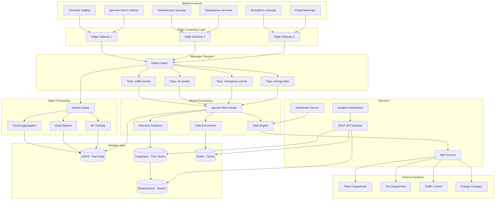
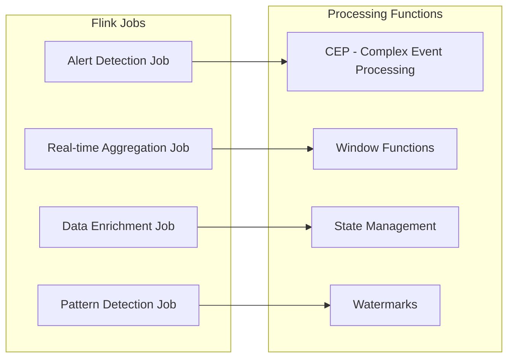
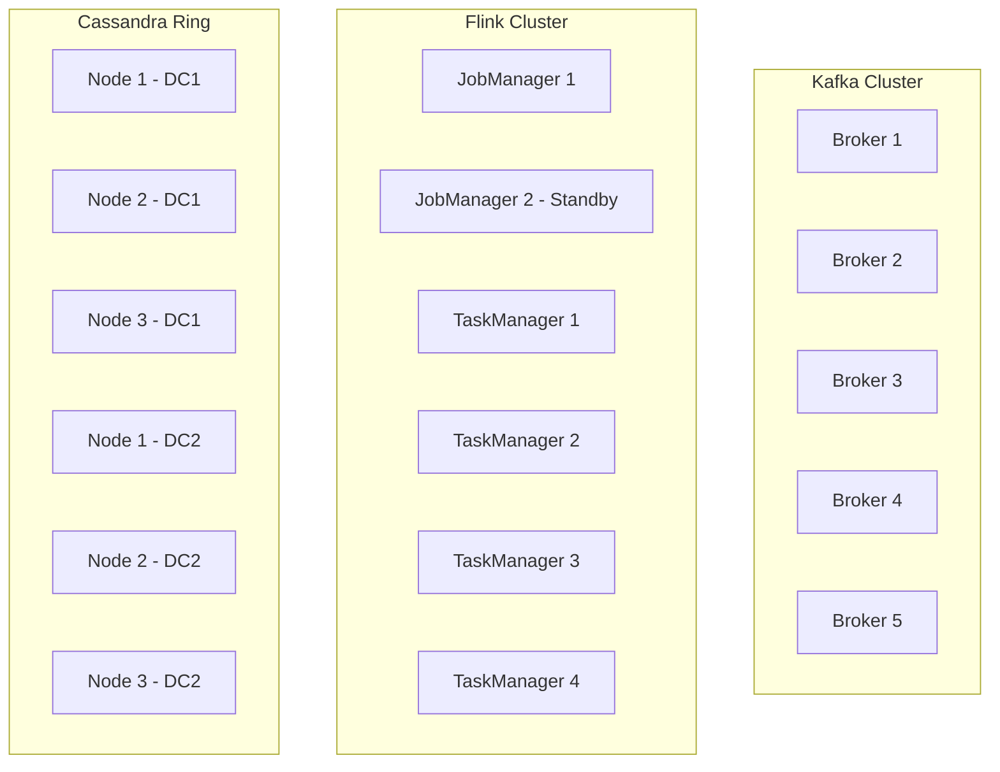
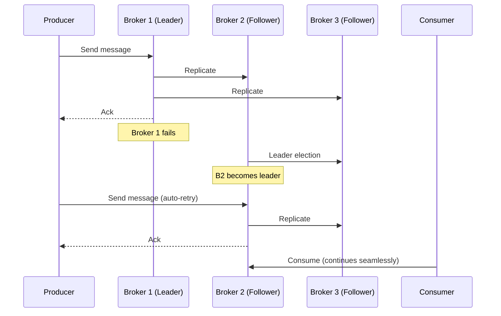
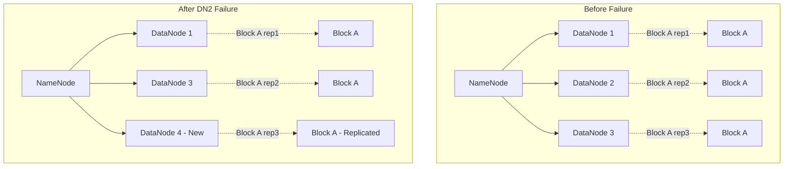
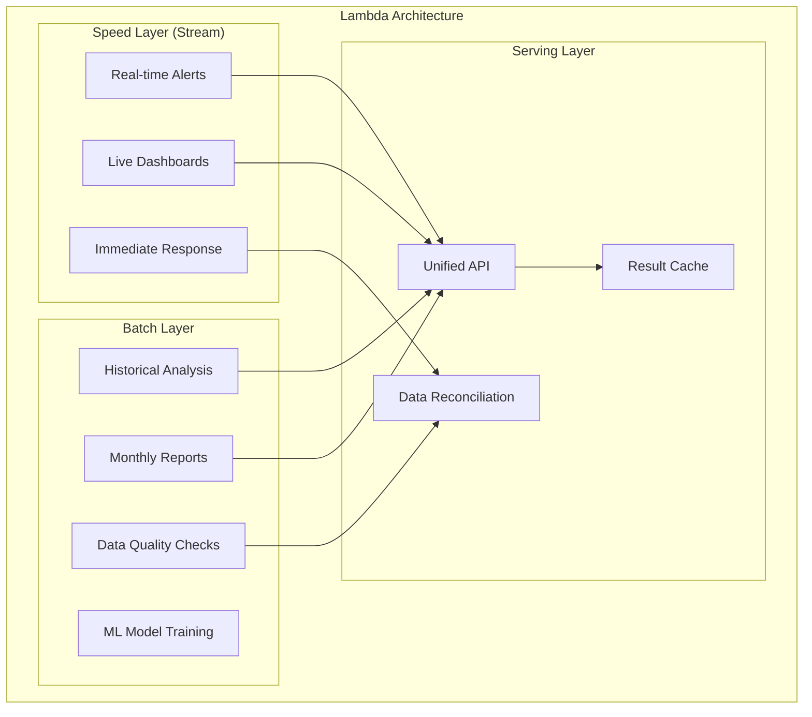

# Архітектура системи «Розумного міста»

## Зміст
1. [Архітектура системи](#архітектура-системи)
2. [Гарантії обробки](#гарантії-обробки)
3. [Відновлення після збоїв](#відновлення-після-збоїв)
4. [Випадки використання](#випадки-використання)

## Архітектура системи

### Загальна архітектурна схема



### Детальний опис компонентів

#### Джерела даних
- Сенсори трафіку - швидкість, кількість, щільність потоків
- Датчики якості повітря - CO₂, PM2.5, озон та інші забруднювачі
- Температурні сенсори - дані від температурних сенсорів для кліматичного моніторингу. 
- Паркувальні системи - події паркувальних систем (зайняття/звільнення місць).
- Аварійні сенсори - події спостережувальних систем пожежі, витоки газу, НС
- Енергомонітори - показники лічильників споживання електроенергії

#### 1. Edge Computing Layer
**Apache NiFi** автоматизує потоки даних, що забезпечує збір, маршрутизацію і трансформацію даних між різними системами. На периферійних шлюзах виконує:
- Первинну фільтрацію та валідація даних
- Локальне кешування при відсутності зв'язку
- Компресію та групування повідомлень для оптимізації мережевого трафіку

**Розподіл периферійних шлюзів:**
- **Edge Gateway 1**: Обробляє дані від сенсорів трафіку та датчиків якості повітря в центральних районах міста
- **Edge Gateway 2**: Збирає дані від температурних сенсорів та паркувальних систем у житлових районах
- **Edge Gateway 3**: Відповідає за критичні системи - аварійні сенсори та енергомонітори для швидкого реагування

#### 2. Message Transport (Apache Kafka)
**Kafka** виступає як центральна шина подій системи, забезпечуючи надійну доставку повідомлень між компонентами. кожен топік оптимізований під специфічні потреби:

- **traffic-events**: Найбільше навантаження (12 розділів), коротке зберігання (7 днів)
- **air-quality**: Середнє навантаження, довше зберігання (30 днів) для екологічного аналізу
- **temperature-data**: Середнє навантаження - 4 розділи (4 квартали), подовжене зберігання - 90 днів (для сезонного аналізу)
- **parking-events**: Середнє навантаження - 6 розділів, коротке зберігання - 14 днів (швидкозмінні дані)
- **emergency-events**: Мінімальні розділи але максимальне зберігання (365 днів) для аудиту
- **energy-data**: Збалансована конфігурація для енергетичних показників

Коефіцієнт реплікації = 3 забезпечує відмовостійкість при виході з ладу до 2 брокерів.
```yaml
# Конфігурація Kafka топіків
topics:
  traffic-events:
    partitions: 12
    replication-factor: 3
    retention: 7d
    
  air-quality:
    partitions: 6
    replication-factor: 3
    retention: 30d

  temperature-data:
    partitions: 4
    replication-factor: 3
    retention: 60d

  parking-events:
    partitions: 6
    replication-factor: 3
    retention: 14d
    
  emergency-events:
    partitions: 3
    replication-factor: 3
    retention: 365d
    
  energy-data:
    partitions: 8
    replication-factor: 3
    retention: 90d
```

#### 3. Stream Processing (Apache Flink)
**Apache Flink** забезпечує потокову обробку даних у реальному часі з низькою затримкою. Різні завдання обробляють специфічні типи подій:

- **Alert Detection Job**: Виявляє критичні ситуації (перевищення CO₂, аварії) через CEP патерни
- **Real-time Aggregation Job**: Обчислює статистики у часових вікнах (середня швидкість трафіку за 5 хвилин)
- **Data Enrichment Job**: Збагачує дані контекстною інформацією (погодні умови, час доби)
- **Pattern Detection Job**: Знаходить складні закономірності поведінки (аномалії в енергоспоживанні)

Функції обробки забезпечують підтримку стану, обробку запізнілих подій через часові мітки (watermarks) та віконні агрегації.


#### 4. Batch Processing (Apache Spark)
**Apache Spark** обробляє великі обсяги даних у пакетному режимі для поглибленого аналізу та звітності. Різні завдання виконують специфічні функції:

- **Hourly Aggregation**: Створює годинні зведення даних (середні показники трафіку, енергоспоживання)
- **Daily Reports**: Формує щоденні звіти для міських служб (статистика паркування, якість повітря)
- **ML Training**: Навчає моделі машинного навчання на історичних даних для прогнозування
- **Data Quality Checks**: Валідує цілісність даних та виявляє аномалії в історичних записах

Spark оптимально використовує ресурси кластера в нічний час, коли навантаження на потокову обробку мінімальне.

#### 5. Storage Layer

**HDFS (Hadoop Distributed File System):**
- Розподілена файлова система для зберігання великих обсягів даних
- Довгострокове зберігання необроблених даних від всіх сенсорів міста
- Розділення по датах: `/data/year=2025/month=10/day=10/hour=14/`
- Відмовостійкість через реплікацію блоків на кілька вузлів (RF=3)
- Оптимізована для пакетної обробки великих файлів Apache Spark

**Apache Cassandra:**
- NoSQL база даних для зберігання часових рядів сенсорних даних
- Високоефективні записи та читання для великих обсягів IoT даних
- Розподілена архітектура без єдиної точки відмови
- Оптимізована для запитів за часовими періодами та локацією
- Автоматичне розподілення даних по вузлах кластера (RF=3)
```cql
-- Схема для time-series даних
CREATE TABLE sensor_data (
    sensor_id text,
    location text,
    timestamp timestamp,
    event_type text,
    value double,
    metadata map<text, text>,
    PRIMARY KEY ((sensor_id, location), timestamp)
) WITH CLUSTERING ORDER BY (timestamp DESC);
```

**Elasticsearch:**
- Індексація для швидкого пошуку
- Агрегації для дашбордів
- Геопросторові запити

**Redis:**
- Високошвидкісний кеш для часто використовуваних даних
- Зберігання результатів обчислень Flink в реальному часі
- Сесії користувачів та тимчасові дані дашбордів
  
Redis доповнює архітектуру зберігання як швидкий кеш між потоковою обробкою та клієнтськими додатками, забезпечуючи низьку латентність для інтерактивних запитів.

### Обґрунтування вибору технологій

**Apache Kafka проти RabbitMQ/ActiveMQ:**
- Висока пропускна здатність (понад 1 мільйон повідомлень на секунду)
- Довготривале зберігання подій для повторного відтворення
- Горизонтальне масштабування через розділення на частини (partitioning)
- Підтримка гарантій одноразової доставки (Exactly Once) з Flink

**Apache Flink проти Apache Storm/Spark Streaming:**
- Справжня потокова обробка (не мікропакетна)
- Низька затримка (менше 100 мілісекунд) критична для аварійних сповіщень
- Вбудована підтримка часу подій та часових міток
- Гарантії одноразової обробки (Exactly Once) через механізм контрольних точок

**Apache Spark проти Hadoop MapReduce:**
- У 10-100 разів швидша обробка завдяки обчисленням у пам'яті
- Уніфікований інтерфейс для пакетної обробки, потоків, машинного навчання та запитів
- Оптимізований для складних аналітичних запитів
- Інтеграція з Delta Lake для транзакційних гарантій

**Cassandra проти MongoDB/PostgreSQL:**
- Лінійне масштабування для інтенсивних операцій запису IoT пристроїв
- Оптимізована для часових рядів з автоматичним терміном життя
- Децентралізована архітектура без єдиної точки відмови
- Висока доступність у географічно розподілених центрах обробки даних

**HDFS проти Amazon S3/Azure Blob:**
- Локальне зберігання для вимог відповідності міської адміністрації
- Інтеграція з екосистемою Hadoop (Spark, Hive)
- Нижча вартість довгострокового зберігання
- Контроль над даними без прив'язки до постачальника

**Redis проти Memcached/Hazelcast:**
- Підтримка складних структур даних (відсортовані множини, хеш-таблиці)
- Збереження даних на диску через механізми резервного копіювання
- Можливості публікації/підписки для сповіщень у реальному часі
- Скриптування для атомарних операцій

### Масштабування та відмовостійкість

#### Горизонтальне масштабування
**Принципи масштабування системи:**

1. **Масштабування без простоїв (Zero-downtime scaling)**
   - Додавання нових вузлів без зупинки сервісів
   - Автоматичне перерозподілення навантаження
   - Поступове введення в експлуатацію нових ресурсів

2. **Еластичність на основі метрик**
   - Моніторинг використання ресурсів у реальному часі
   - Автоматичне збільшення/зменшення кількості інстансів
   - Адаптація до денних та сезонних коливань навантаження

3. **Розподіл навантаження за географічним принципом**
   - Окремі кластери для різних районів міста
   - Локальна обробка даних для зменшення затримок
   - Центральна координація для міських рішень


#### Механізми відмовостійкості
1. **Рівень інфраструктури:**
   - **Kafka**: Мінімум 3 репліки для кожного топіку, синхронні репліки (ISR)
   - **Flink**: Контрольні точки кожні 30 секунд, збереження стану в HDFS
   - **Cassandra**: Коефіцієнт реплікації = 3, рівень узгодженості QUORUM
   - **HDFS**: Фактор реплікації = 3, автоматичне відновлення блоків

2. **Рівень застосунків:**
   - Ідемпотентні операції для уникнення дублювання
   - Механізми повторних спроб з експоненційним відступом
   - Автоматичне перемикання на резервні сервіси (Circuit Breaker)
   - Контроль цілісності даних через контрольні суми

3. **Рівень мережі:**
   - Множинні мережеві з'єднання між компонентами
   - Автоматичне виявлення та обхід недоступних вузлів
   - Розподілене розміщення в різних центрах обробки даних
   - Резервування критичних мережевих з'єднань

**Стратегії відновлення:**
- **RTO (Recovery Time Objective)**: менше 30 секунд для критичних сервісів
- **RPO (Recovery Point Objective)**: втрата даних не більше 1 хвилини
- **Автоматичне failover**: без втручання оператора для типових відмов
- **Каскадне відновлення**: поетапне відновлення залежних сервісів

## Гарантії обробки

### Матриця гарантій по компонентах

| Компонент | Гарантія |
|-----------|----------|
| **Edge → Kafka** | At Least Once |
| **Kafka → Flink (Alerts)** | Exactly Once |
| **Kafka → Flink (Analytics)** | At Least Once |
| **Flink → Cassandra** | At Least Once |
| **Spark Batch Jobs** | Exactly Once |
| **Alert Notifications** | Exactly Once |
### Детальне обґрунтування гарантій по компонентах

#### 1. Edge → Kafka (At Least Once)

**Чому обрано At Least Once:**
- **Мережева нестабільність**: Периферійні пристрої можуть мати нестабільне з'єднання з інтернетом
- **Критичність даних**: Краще отримати дублікат сенсорних даних, ніж втратити важливі показники
- **Простота реалізації**: Механізм повторних спроб простіший за транзакційні гарантії на edge пристроях

**Обробка дублікатів**: Kafka автоматично дедуплікує повідомлення з однаковим ключем завдяки idempotent producer.

#### 2. Kafka → Flink (Alerts) (Exactly Once)

**Чому обрано Exactly Once:**
- **Критичність аварійних сповіщень**: Дублювання може призвести до паніки або неправильних рішень
- **Юридична відповідальність**: Міська адміністрація несе відповідальність за точність аварійних повідомлень
- **Зовнішні виклики**: Сповіщення до поліції/пожежної служби мають бути точними

**Механізм**: Комбінація Kafka транзакцій та Flink checkpointing забезпечує атомарність операцій.

#### 3. Kafka → Flink (Analytics) (At Least Once)

**Чому обрано At Least Once:**
- **Толерантність до дублікатів**: Статистичні розрахунки можуть поглинути невеликі дублікати
- **Продуктивність**: Exactly Once має значний вплив на латентність (~30% зниження швидкості)
- **Природа аналітики**: Агреговані метрики менш чутливі до окремих дублікатів

**Компенсація**: Використання ідемпотентних агрегацій (середнє значення, максимум) та деупдуплікація на рівні візуалізації.

#### 4. Flink → Cassandra (At Least Once)

**Чому обрано At Least Once:**
- **Природа time-series даних**: Cassandra оптимізована для вставки дублікатів з однаковим primary key
- **Upsert операції**: INSERT з IF NOT EXISTS або UPDATE операції природно ідемпотентні
- **Продуктивність запису**: Exactly Once значно уповільнює записи в Cassandra

**Гарантія ідемпотентності**: Структура primary key (sensor_id, timestamp) запобігає дублікатам.

#### 5. Spark Batch Jobs (Exactly Once)

**Чому обрано Exactly Once:**
- **Фінансові розрахунки**: Місячні звіти впливають на бюджетні рішення міста
- **Регулятивна звітність**: Звіти подаються до державних органів
- **Історична точність**: Batch обробка формує "джерело істини" для аналітики

**Механізм**: Delta Lake забезпечує версіонування, rollback та атомарні операції запису.

#### 6. Alert Notifications (Exactly Once)

**Чому обрано Exactly Once:**
- **Зовнішні системи**: Повторні виклики до поліції/пожежної можуть спричинити хибні тривоги
- **Ресурсні витрати**: Дублювання аварійних бригад коштує значні кошти
- **Довіра системі**: Надійність критична для прийняття системи користувачами

**Механізм**: Комбінація Redis для дедуплікації та ідемпотентних API викликів до зовнішніх систем.


**Exactly Once семантика забезпечує, що кожна критична подія (аварійне сповіщення або тривожне повідомлення) обробляється рівно один раз, навіть при збоях системи.**

#### Архітектурні принципи:

1. **Стан системи (State Management)**
   - Збереження інформації про оброблені події
   - Контрольні точки для відновлення після збоїв
   - Розподілений стан із гарантіями консистентності

2. **Ідемпотентність операцій**
   - Унікальні ідентифікатори для кожної події
   - Повторне виконання не змінює результат
   - Умовні операції в базах даних

3. **Транзакційна семантика**
   - Атомарність операцій через декілька систем
   - Двофазні затвердження (commit) для забезпечення консистентності
   - Відкочування (Rollback) при частковій невдачі

4. **Дедуплікація**
   - Відстеження вже оброблених подій
   - Автоматичне відхилення дублікатів
   - Очищення застарілих записів

#### Критичні аспекти реалізації:

- **Детермінованість**: Однакові дані завжди дають однаковий результат
- **Часова узгодженість**: Використання event time замість processing time
- **Відмовостійкість**: Швидке відновлення після збоїв без втрати даних
- **Продуктивність**: Мінімальний вплив на швидкість обробки критичних подій

## Відновлення після збоїв

### Сценарії відмов та recovery стратегії

#### 1. Відмова Kafka Broker



**Механізм відновлення:**
- Автоматичний вибір нового лідера серед синхронних реплік(ISR)
- Виробники (producers) автоматично повторюють спроби з новим лідером
- Споживачі (consumers) продовжують читання з нового лідера
- Відновлені дані реплікуються на новий брокер

#### 2. Відмова Flink JobManager

**Процес відновлення:**
1. Резервний керівник завдань стає активним
2. Відновлення стану з останньої контрольної точки
3. Перезапуск невдалих завдань з позиції контрольної точки
4. Споживачі продовжують з збереженого зміщення

#### 3. Відмова HDFS DataNode



**Кроки відновлення:**
1. Головний вузол виявляє відмову вузла даних
2. Позначає блоки як недореплікованні
3. Планує повторну реплікацію на здорові вузли
4. Оновлює розташування блоків у метаданих


### Поведінка системи при відмовах компонентів

#### Стратегії відновлення для кожного компонента

**При відмові вузла Kafka:**
- Система автоматично перемикається на резервний брокер із синхронних реплік
- Виробники і споживачі даних продовжують роботу без переривання
- Дані зберігаються завдяки реплікації на мінімум 3 вузли
- Новий лідер вибирається протягом 5-15 секунд
- Відновлення втраченого вузла відбувається автоматично при поверненні в мережу

**При відмові Spark-кластера:**
- Активні завдання переносяться на резервні вузли виконання
- Незавершені пакетні обробки перезапускаються з останньої збереженої контрольної точки
- Історичні дані залишаються доступними через HDFS
- Система може працювати лише з потоковою обробкою до відновлення Spark
- Критичні звіти генеруються з дещо затриманим графіком

**При відмові HDFS-вузла:**
- Головний вузол автоматично виявляє недоступність вузла даних
- Система використовує альтернативні копії блоків із інших вузлів
- Запускається процес реплікації для відновлення втрачених копій
- Читання та запис даних продовжується без переривання
- Нові дані автоматично розподіляються на доступні вузли

#### Каскадні ефекти та їх мінімізація
**Принципи ізоляції відмов:**
- Кожен компонент має незалежні резервні копії
- Критичні процеси дублюються на різних географічних локаціях
- Система моніторингу автоматично перерозподіляє навантаження
- Черги повідомлень буферизують дані під час тимчасових недоступностей

**Пріоритетність відновлення:**
1. Першочергово відновлюються системи аварійного реагування
2. Потім відновлюється потокова обробка критичних даних
3. Нарешті запускаються пакетні процеси та аналітика
4. Система поступово повертається до повної функціональності

### Механізми відновлення без втрати даних

#### Стратегії збереження стану обробки
**Контрольні точки (Checkpointing):**
- Система регулярно зберігає поточний стан обробки на надійні носії
- При збої відновлення починається з останньої успішної контрольної точки
- Використовується розподілене зберігання для запобігання втрати контрольних точок
- Автоматичне створення резервних копій стану з заданими інтервалами

**Журналювання транзакцій:**
- Всі зміни даних фіксуються в журналі перед застосуванням
- При відмові система відтворює операції з журналу для повного відновлення
- Журнали реплікуються на кілька незалежних вузлів
- Можливість відкату до будь-якої попередньої точки в часі

**Ідемпотентність операцій:**
- Повторне виконання операції не змінює кінцевий результат
- Кожна подія має унікальний ідентифікатор для запобігання дублюванню
- Використання умовних операцій запису ("записати, якщо не існує")
- Автоматична дедуплікація на всіх рівнях обробки

#### Забезпечення безперервності потоку даних
**Буферизація повідомлень:**
- Тимчасове зберігання даних у чергах при недоступності наступного компонента
- Автоматичне збільшення буферів при пікових навантаженнях
- Персистентні черги зберігають дані навіть після перезапуску системи
- Пріоритизація критичних повідомлень у чергах

**Механізми повторних спроб:**
- Експоненційний відступ між спробами для уникнення перевантаження
- Максимальна кількість спроб перед переходом до резервного сценарію
- Різні стратегії повторів для різних типів помилок
- Dead letter queues для повідомлень, що не вдалося обробити

### Контроль цілісності даних

#### Системи верифікації цілісності
**Контрольні суми та хешування:**
- Автоматичне обчислення контрольних сум для всіх даних
- Перевірка цілісності при кожній операції читання та запису
- Використання криптографічних хеш-функцій для виявлення навіть мінімальних змін
- Порівняння контрольних сум між репліками для виявлення розбіжностей

**Схеми даних та валідація:**
- Строга типізація та валідація всіх вхідних даних
- Централізований реєстр схем для забезпечення сумісності
- Автоматичне відхилення некоректних або неповних даних
- Еволюція схем з підтримкою зворотної сумісності

**Метадані та відстеження походження:**
- Детальне логування походження кожного фрагмента даних
- Фіксація всіх трансформацій та операцій над даними
- Можливість відстеження даних від джерела до кінцевого споживача
- Аудиторські журнали для всіх операцій з даними

#### Моніторинг якості даних
**Автоматизовані перевірки якості:**
- Реалтайм валідація даних на відповідність бізнес-правилам
- Статистичний аналіз для виявлення аномалій у потоках даних
- Порівняння з історичними показниками для виявлення відхилень
- Алерти при критичних порушеннях якості даних

**Узгодженість між системами:**
- Регулярна звірка даних між різними сховищами
- Автоматичне виявлення та виправлення розбіжностей
- Механізми eventual consistency для розподілених систем
- Координація транзакцій між кількома базами даних

## Випадки використання

### 1. Stream Processing: Виявлення перевищення рівня CO₂ на перехресті в реальному часі

#### Flink SQL запит
```sql
-- Виявлення перевищення рівня CO₂ в реальному часі
CREATE TABLE air_quality_stream (
    sensor_id STRING,
    location STRING,
    timestamp TIMESTAMP(3),
    co2_level DOUBLE,
    temperature DOUBLE,
    humidity DOUBLE,
    WATERMARK FOR timestamp AS timestamp - INTERVAL '10' SECONDS
) WITH (
    'connector' = 'kafka',
    'topic' = 'air-quality',
    'properties.bootstrap.servers' = 'kafka:9092',
    'format' = 'avro'
);

-- CEP pattern для виявлення стійких перевищень
CREATE TABLE co2_alerts AS
SELECT 
    location,
    AVG(co2_level) as avg_co2,
    MAX(co2_level) as max_co2,
    COUNT(*) as readings_count,
    TUMBLE_START(timestamp, INTERVAL '5' MINUTES) as window_start,
    TUMBLE_END(timestamp, INTERVAL '5' MINUTES) as window_end
FROM air_quality_stream
WHERE co2_level > 800 -- Критичний рівень CO₂
GROUP BY 
    location,
    TUMBLE(timestamp, INTERVAL '5' MINUTES)
HAVING COUNT(*) >= 3; -- Мінімум 3 вимірювання в вікні
    AND location = crossroad_187 -- перехрестя №187
```
**Чому Stream Processing оптимальний:**
- **Швидкість**: Сповіщення за 5-10 секунд після виявлення
- **Безперервний моніторинг**: Постійний аналіз даних у реальному часі
- **Обробка зі станом**: Відстеження трендів та закономірностей
- **Низька затримка**: Критично важливо для аварійного реагування

### 2. Batch Processing: Місячна статистика шуму по районах

#### Spark SQL запит
```sql
-- Пакетний аналіз шумового забруднення
WITH hourly_noise AS (
    SELECT 
        location,
        district,
        date_trunc('hour', timestamp) as hour,
        AVG(noise_level) as avg_noise,
        MAX(noise_level) as max_noise,
        MIN(noise_level) as min_noise,
        PERCENTILE_CONT(0.5) WITHIN GROUP (ORDER BY noise_level) as median_noise
    FROM noise_sensors_data
    WHERE timestamp >= '2025-09-01' 
      AND timestamp < '2025-10-01'
    GROUP BY location, district, date_trunc('hour', timestamp)
),
daily_noise AS (
    SELECT 
        district,
        date_trunc('day', hour) as day,
        AVG(avg_noise) as daily_avg_noise,
        MAX(max_noise) as daily_max_noise,
        MIN(min_noise) as daily_min_noise,
        AVG(median_noise) as daily_median_noise
    FROM hourly_noise
    GROUP BY district, date_trunc('day', hour)
)
SELECT 
    district,
    AVG(daily_avg_noise) as monthly_avg_noise,
    MAX(daily_max_noise) as monthly_max_noise,
    MIN(daily_min_noise) as monthly_min_noise,
    PERCENTILE_CONT(0.95) WITHIN GROUP (ORDER BY daily_avg_noise) as p95_noise,
    STDDEV(daily_avg_noise) as noise_std_deviation,
    COUNT(DISTINCT day) as days_with_data,
    -- Категоризація районів за рівнем шуму
    CASE 
        WHEN AVG(daily_avg_noise) > 70 THEN 'HIGH_NOISE'
        WHEN AVG(daily_avg_noise) > 55 THEN 'MODERATE_NOISE'
        ELSE 'LOW_NOISE'
    END as noise_category,
    -- Compliance з нормами ЄС
    SUM(CASE WHEN daily_avg_noise > 55 THEN 1 ELSE 0 END) / COUNT(*) * 100 as pct_exceeding_eu_limit
FROM daily_noise
GROUP BY district
ORDER BY monthly_avg_noise DESC;
```

**Чому Batch Processing оптимальний:**
- **Великі обсяги**: Аналіз мільйонів записів за місяць
- **Складні агрегації**: Багаторівневе групування, процентилі, статистичні функції
- **Історичний аналіз**: Порівняння з попередніми періодами
- **Ефективність ресурсів**: Оптимальне використання кластера в години низького навантаження
- **Узгодженість даних**: Повний набір даних для точних розрахунків

### Архітектурні переваги розділення Stream/Batch



**Переваги гібридного підходу:**
1. **Оптимізація затримки**: Потокова обробка для реального часу, пакетна для точності
2. **Використання ресурсів**: Потокова обробка 24/7, пакетна в нічний час
3. **Відмовостійкість**: Пакетний рівень як резервна копія для результатів потоків
4. **Гнучкість**: Різні рівні обслуговування для різних випадків використання
5. **Оптимізація витрат**: Спотові інстанси для пакетних завдань

## Висновки

Запропонована архітектура забезпечує:

### **Ключові характеристики**

- **Масштабованість**: Горизонтальне масштабування всіх компонентів
- **Відмовостійкість**: Багаторівнева надмірність та автоматичне відновлення
- **Низька затримка**: <1 секунда для критичних сповіщень
- **Висока пропускна здатність**: >1M подій/секунду
- **Узгодженість даних**: Exactly-once для критичних операцій

### **Метрики та рівні обслуговування**

- **Час відповіді сповіщень**: <5 секунд для надзвичайних подій
- **Доступність системи**: 99.9% часу роботи
- **Зберігання даних**: 7 років для відповідності вимогам
- **Час відновлення**: <30 секунд для відмов компонентів

### **Операційні переваги**

- **Уніфікований моніторинг**: Prometheus + Grafana для всіх компонентів
- **Автоматизоване масштабування**: Kubernetes HPA на основі метрик
- **Управління даними**: Реєстр схем та відстеження походження даних
- **Оптимізація витрат**: Інтелектуальне розподілення даних (використання різних типів сховищ)

Ця архітектура забезпечує надійну основу для системи розумного міста з можливістю еволюції та розширення функціональності.

