# Архітектура мікросервісів авіакомпанії

## Зміст
1. [Огляд системи](#огляд-системи)
2. [Комунікація між мікросервісами](#комунікація-між-мікросервісами)
3. [Архітектура платіжного сервісу](#архітектура-платіжного-сервісу)
4. [Стратегія обробки помилок](#стратегія-обробки-помилок)
5. [Версіювання API](#версіювання-api)
6. [Інтеграція сервісу рекомендацій](#інтеграція-сервісу-рекомендацій)
7. [Діаграми архітектури](#діаграми-архітектури)
8. [Аналіз потенційних проблем](#аналіз-потенційних-проблем)

## Огляд системи

### Основні мікросервіси авіакомпанії:

1. **User Service** - управління користувачами та автентифікація
2. **Flight Service** - управління рейсами та розкладом
3. **Booking Service** - бронювання квитків
4. **Payment Service** - обробка платежів
5. **Inventory Service** - управління наявністю місць
6. **Notification Service** - сповіщення користувачів
7. **Search Service** - пошук рейсів
8. **Recommendation Service** - персоналізовані рекомендації
9. **API Gateway** - єдина точка входу

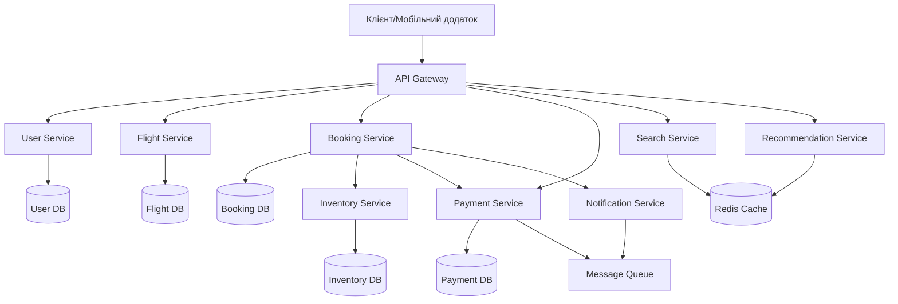

## Комунікація між мікросервісами

### 1. Типи комунікації та технології

#### Синхронна комунікація (Request-Response):

**REST API** - для стандартних CRUD операцій:
- User Service ↔ API Gateway
- Flight Service ↔ Search Service
- Booking Service ↔ Inventory Service (перевірка наявності)

**gRPC** - для високопродуктивної міжсервісної комунікації:
- Booking Service ↔ Payment Service (критично важливі операції)
- Inventory Service ↔ Flight Service (швидкі запити стану)

**GraphQL** - для клієнтських запитів через API Gateway:
- Мобільні додатки та веб-інтерфейс
- Гнучкі запити даних з декількох сервісів

#### Асинхронна комунікація (Event-Driven):

**Apache Kafka** - для критичних подій:
- Обробка платежів
- Зміни в бронюваннях
- Оновлення інвентаризації

**RabbitMQ** - для менш критичних повідомлень:
- Сповіщення користувачів
- Логування подій
- Оновлення рекомендацій

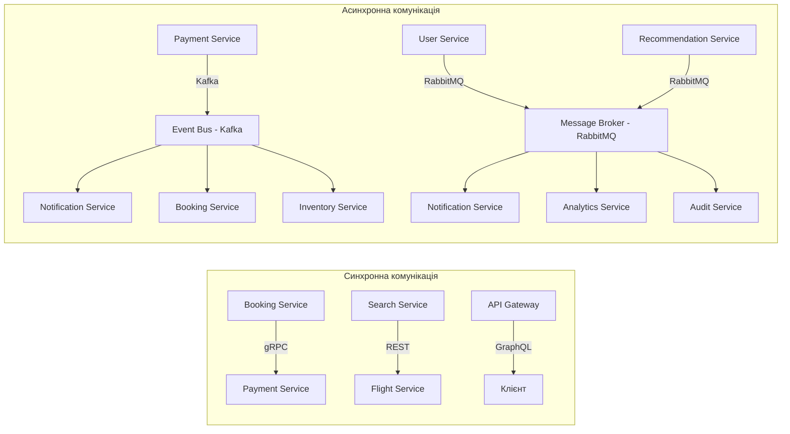

### 2. Обґрунтування вибору технологій

| Пара сервісів | Технологія | Обґрунтування |
|--------------|------------|---------------|
| API Gateway ↔ Клієнт | GraphQL | Гнучкість запитів, зменшення over-fetching |
| Booking ↔ Payment | gRPC | Високою продуктивність, строга типізація |
| Booking ↔ Inventory | REST | Простота інтеграції, стандартизація |
| Payment → Events | Kafka | Гарантована доставка, високий throughput |
| Notification ← Events | RabbitMQ | Гнучкі patterns доставки |

### 3. Сценарії пікових навантажень

#### Флеш-розпродажі:
- **Circuit Breaker** для захисту сервісів
- **Rate Limiting** на рівні API Gateway
- **Async processing** для неблокуючої обробки
- **Horizontal scaling** критичних сервісів

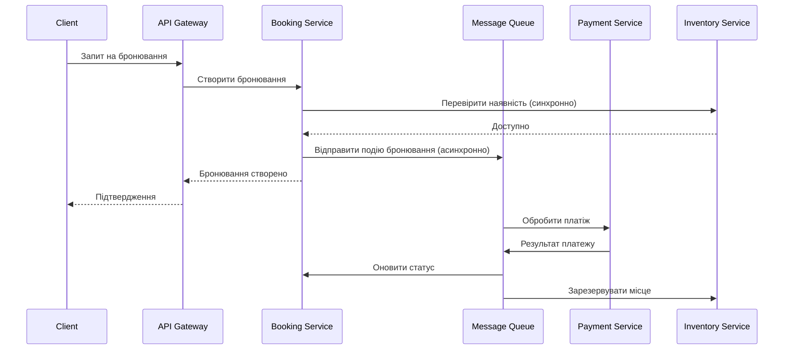

## Архітектура платіжного сервісу

### 1. Компоненти архітектури

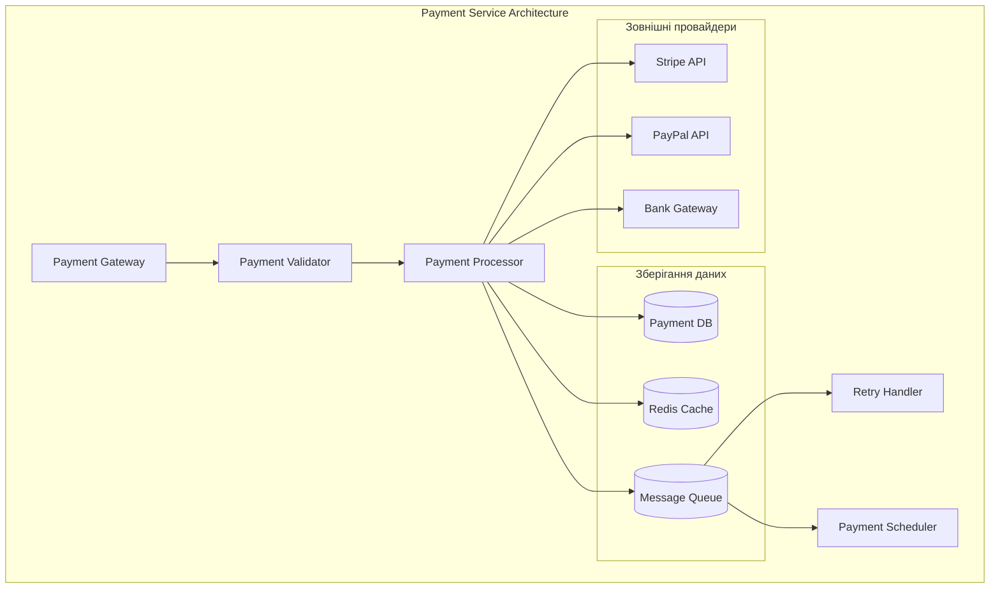

### 2. Механізми оптимізації

#### Черги повідомлень:
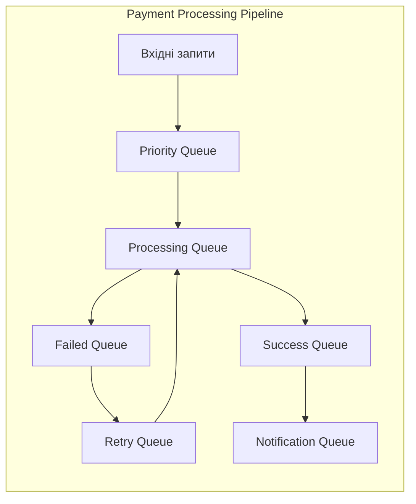

#### Кешування:
- **L1 Cache**: In-memory кеш для частих запитів
- **L2 Cache**: Redis для розподіленого кешування
- **Database Cache**: Кешування результатів запитів БД

#### Rate Limiting:
```javascript
// Приклад конфігурації rate limiting
{
  "standard_user": {
    "requests_per_minute": 60,
    "burst_limit": 10
  },
  "premium_user": {
    "requests_per_minute": 300,
    "burst_limit": 50
  },
  "flash_sale": {
    "requests_per_minute": 1000,
    "burst_limit": 200
  }
}
```

### 3. Автоматичне масштабування

```yaml
# Kubernetes HPA конфігурація
apiVersion: autoscaling/v2
kind: HorizontalPodAutoscaler
metadata:
  name: payment-service-hpa
spec:
  scaleTargetRef:
    apiVersion: apps/v1
    kind: Deployment
    name: payment-service
  minReplicas: 3
  maxReplicas: 20
  metrics:
  - type: Resource
    resource:
      name: cpu
      target:
        type: Utilization
        averageUtilization: 70
  - type: Resource
    resource:
      name: memory
      target:
        type: Utilization
        averageUtilization: 80
```

## Стратегія обробки помилок

### 1. Типи помилок та стратегії

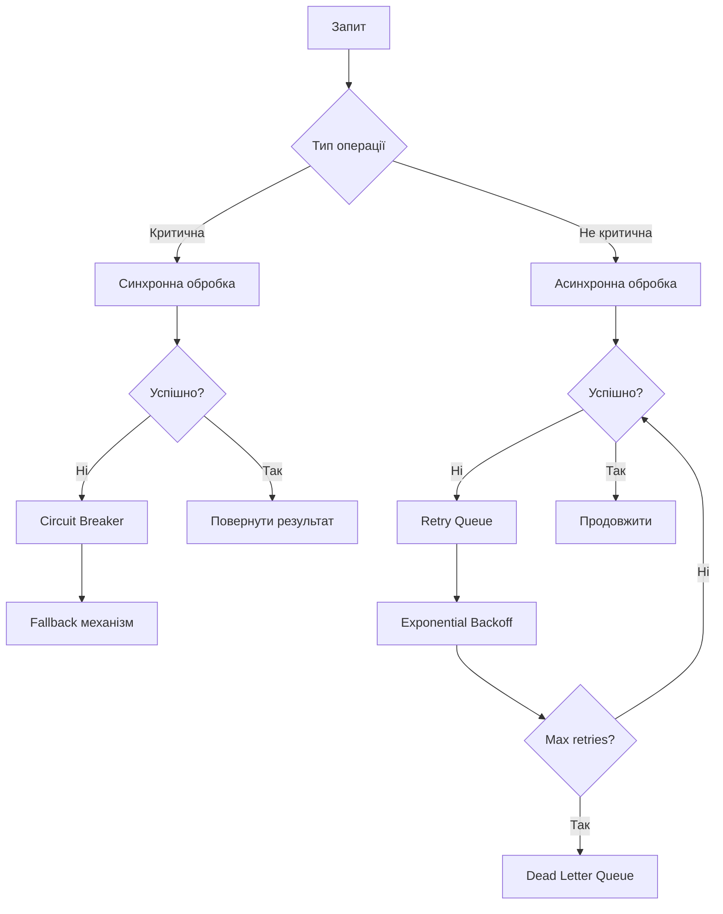

### 2. Механізми відновлення

#### Circuit Breaker Pattern:
```javascript
class CircuitBreaker {
  constructor(threshold = 5, timeout = 60000) {
    this.failureThreshold = threshold;
    this.timeout = timeout;
    this.failureCount = 0;
    this.state = 'CLOSED'; // CLOSED, OPEN, HALF_OPEN
    this.nextAttempt = Date.now();
  }

  async call(fn) {
    if (this.state === 'OPEN') {
      if (Date.now() < this.nextAttempt) {
        throw new Error('Circuit breaker is OPEN');
      }
      this.state = 'HALF_OPEN';
    }

    try {
      const result = await fn();
      this.onSuccess();
      return result;
    } catch (error) {
      this.onFailure();
      throw error;
    }
  }
}
```

#### Retry механізм з Exponential Backoff:
```javascript
async function retryWithBackoff(fn, maxRetries = 3, baseDelay = 1000) {
  for (let attempt = 1; attempt <= maxRetries; attempt++) {
    try {
      return await fn();
    } catch (error) {
      if (attempt === maxRetries) throw error;
      
      const delay = baseDelay * Math.pow(2, attempt - 1);
      await new Promise(resolve => setTimeout(resolve, delay));
    }
  }
}
```

### 3. Fallback стратегії

#### Платіжний сервіс:
- **Primary**: Основний платіжний провайдер
- **Secondary**: Резервний провайдер
- **Offline**: Збереження для подальшої обробки

#### Сервіс інвентаризації:
- **Cache Fallback**: Використання кешованих даних
- **Read Replica**: Читання з реплік БД
- **Graceful Degradation**: Повернення обмежених даних

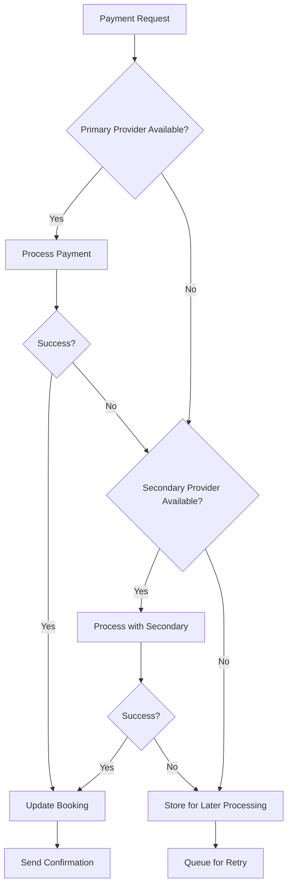

## Версіювання API

### 1. Стратегія версіювання для Booking Service

#### URL-based versioning:
```
GET /api/v1/bookings/{id}
GET /api/v2/bookings/{id}
```

#### Header-based versioning:
```
GET /api/bookings/{id}
Accept: application/vnd.airline.v1+json
Accept: application/vnd.airline.v2+json
```

### 2. GraphQL для вирішення проблем версіювання

```graphql
# Schema evolution з GraphQL
type Booking {
  id: ID!
  flightId: ID!
  passengerName: String!
  seatNumber: String
  
  # Нові поля (зворотна сумісність)
  passengerDetails: PassengerDetails
  preferences: BookingPreferences
  
  # Deprecated поля
  legacyPassengerInfo: String @deprecated(reason: "Use passengerDetails instead")
}

type PassengerDetails {
  firstName: String!
  lastName: String!
  email: String!
  phone: String
  dateOfBirth: String
}
```

### 3. Стратегія міграції

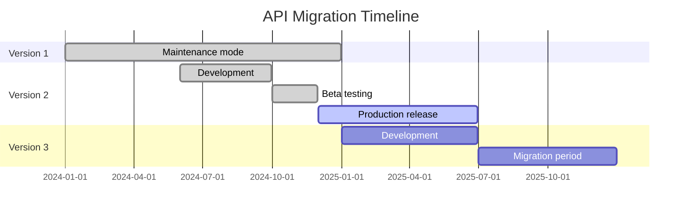

#### Backward Compatibility Strategy:
```javascript
// API Gateway adapter для зворотної сумісності
class ApiVersionAdapter {
  adaptRequest(version, request) {
    switch(version) {
      case 'v1':
        return this.adaptV1ToV2(request);
      case 'v2':
        return request; // Current version
      default:
        throw new Error('Unsupported API version');
    }
  }
  
  adaptResponse(version, response) {
    switch(version) {
      case 'v1':
        return this.adaptV2ToV1(response);
      case 'v2':
        return response;
      default:
        throw new Error('Unsupported API version');
    }
  }
}
```

## Інтеграція сервісу рекомендацій

### 1. Архітектура сервісу рекомендацій

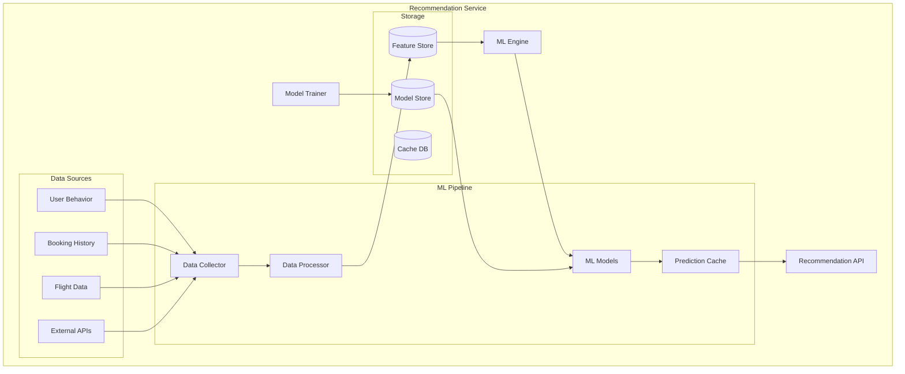

### 2. Event-Driven Architecture для Real-time обробки

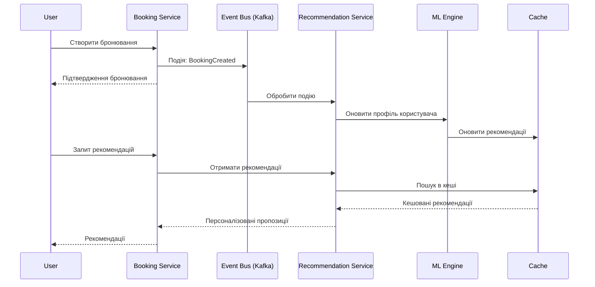

### 3. Технології для комунікації

#### Apache Kafka для Event Streaming:
```yaml
# Kafka топіки для рекомендацій
topics:
  user-interactions:
    partitions: 12
    replication-factor: 3
    retention: 7d
  
  booking-events:
    partitions: 6
    replication-factor: 3
    retention: 30d
    
  flight-updates:
    partitions: 3
    replication-factor: 3
    retention: 1d
```

#### gRPC для швидкої комунікації:
```protobuf
// recommendation.proto
service RecommendationService {
  rpc GetRecommendations(RecommendationRequest) returns (RecommendationResponse);
  rpc UpdateUserProfile(UserProfileUpdate) returns (UpdateResponse);
  rpc TrainModel(TrainModelRequest) returns (TrainModelResponse);
}

message RecommendationRequest {
  string user_id = 1;
  RecommendationContext context = 2;
  int32 limit = 3;
}

message RecommendationResponse {
  repeated FlightRecommendation recommendations = 1;
  float confidence_score = 2;
  string model_version = 3;
}
```

### 4. Обробка даних в реальному часі

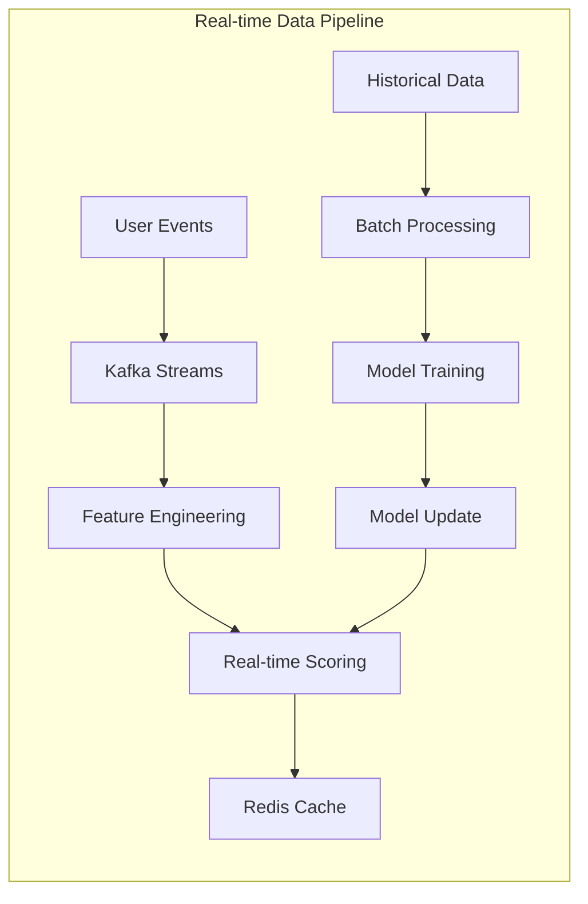

#### Kafka Streams обробка:
```java
// Приклад обробки потоку подій
KStream<String, UserInteraction> userInteractions = builder
    .stream("user-interactions")
    .filter((key, interaction) -> interaction.getEventType().equals("SEARCH"))
    .groupByKey()
    .windowedBy(TimeWindows.of(Duration.ofMinutes(10)))
    .aggregate(
        UserSession::new,
        (key, interaction, session) -> session.addInteraction(interaction),
        Materialized.as("user-sessions")
    );
```

## Діаграми архітектури

### 1. Повна архітектура системи

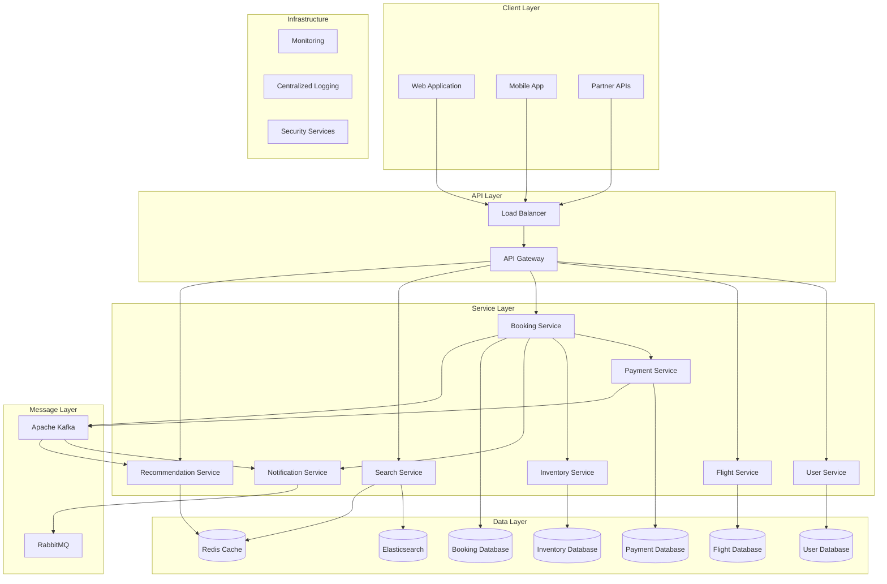

### 2. Потік даних при бронюванні

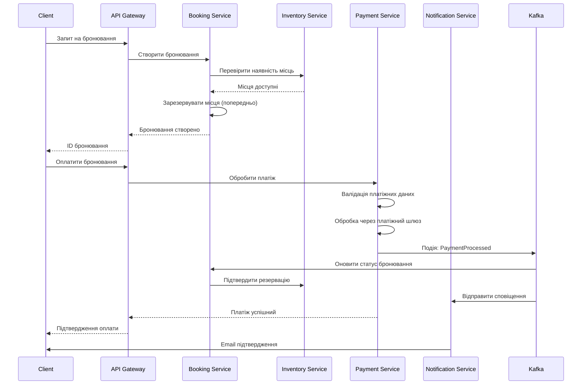

### 3. Обробка помилок та відновлення

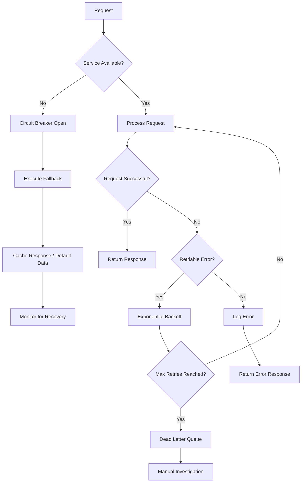

## Аналіз потенційних проблем

### 1. Вузькі місця системи

#### Проблема: Bottleneck в Inventory Service
**Опис**: При високому навантаженні сервіс інвентаризації може стати вузьким місцем через часті запити на перевірку наявності місць.

**Рішення**:
- **Кешування**: Агресивне кешування даних про наявність місць
- **Read Replicas**: Використання реплік БД для читання
- **Event Sourcing**: Асинхронне оновлення стану інвентаризації

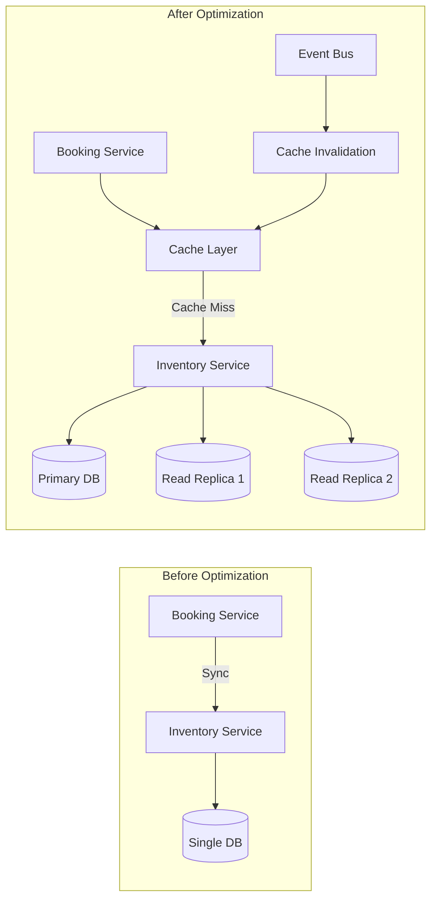

#### Проблема: Латентність мережі між сервісами
**Опис**: Множинні синхронні виклики між сервісами збільшують загальну латентність.

**Рішення**:
- **Service Mesh**: Istio для оптимізації мережевих викликів
- **Connection Pooling**: Повторне використання з'єднань
- **Bulk Operations**: Групування запитів

### 2. Проблеми масштабування

#### Data Consistency при горизонтальному масштабуванні
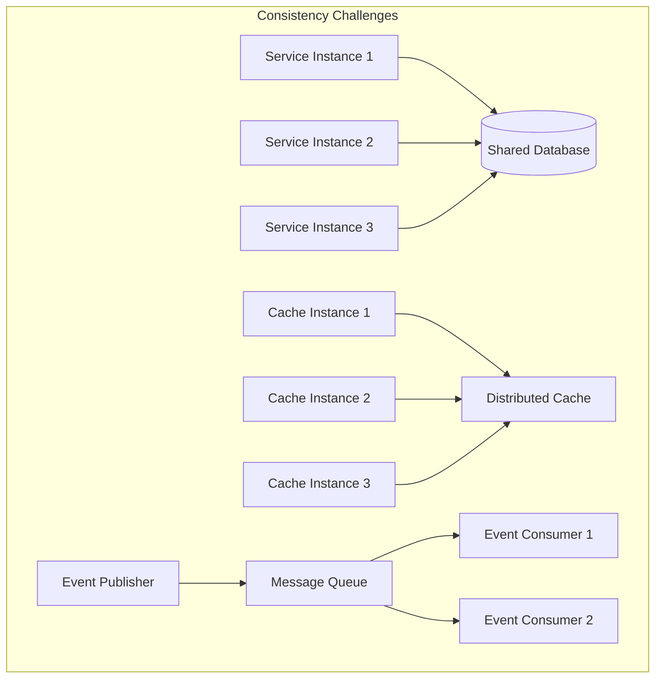

**Стратегії вирішення**:
- **Database Sharding**: Розподіл даних по шардах
- **Event Sourcing**: Збереження послідовності подій
- **CQRS**: Розділення команд та запитів

### 3. Проблеми безпеки

#### API Security та Rate Limiting
```yaml
# API Gateway Security Configuration
security:
  authentication:
    type: "JWT"
    provider: "Auth0"
  
  rate_limiting:
    default: "100req/min"
    premium: "500req/min"
    burst: "50req/10sec"
  
  cors:
    allowed_origins: ["https://airline.com", "https://mobile.airline.com"]
    allowed_methods: ["GET", "POST", "PUT", "DELETE"]
```

### 4. Моніторинг та спостережуваність

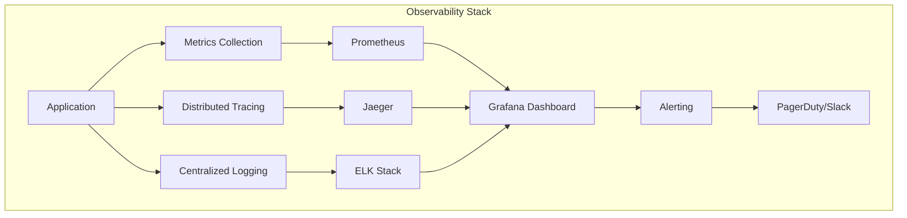

### 5. Стратегії мітігації ризиків

#### Disaster Recovery Plan
```mermaid
gantt
    title Disaster Recovery Timeline
    dateFormat  HH:mm
    axisFormat %H:%M
    
    section Detection
    Monitoring alerts    :done, detect, 00:00, 00:05
    
    section Response
    Team notification   :done, notify, 00:05, 00:10
    Initial assessment  :active, assess, 00:10, 00:20
    
    section Recovery
    Failover execution  :failover, 00:20, 00:30
    Service restoration :restore, 00:30, 01:00
    
    section Validation
    System testing      :test, 01:00, 01:15
    Full service resume :resume, 01:15, 01:30
```

#### Business Continuity
- **Multi-region deployment**: Географічне розподілення сервісів
- **Graceful degradation**: Поступове зниження функціональності при проблемах
- **Feature flags**: Можливість швидкого відключення проблемних функцій

### 6. Технічний борг та технологічна еволюція

#### Legacy System Integration
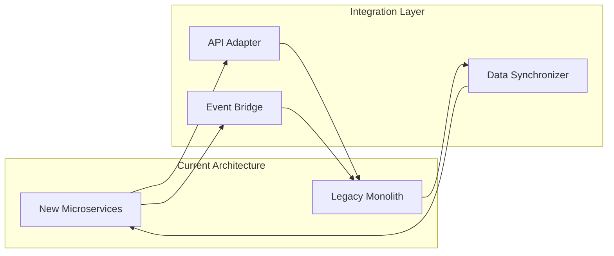

#### Migration Strategy
1. **Strangler Fig Pattern**: Поступова заміна legacy компонентів
2. **Database Decomposition**: Розділення монолітної БД
3. **API Versioning**: Підтримка backward compatibility

## Висновки

Розроблена архітектура мікросервісів для авіакомпанії забезпечує:

1. **Високу продуктивність** через оптимальний вибір технологій комунікації
2. **Надійність** завдяки комплексній стратегії обробки помилок
3. **Масштабованість** через асинхронну обробку та кешування
4. **Гнучкість** за рахунок версіювання API та модульної архітектури
5. **Інноваційність** через інтеграцію ML-сервісу рекомендацій

Ключові переваги запропонованого рішення:
- Використання event-driven архітектури для критичних операцій
- Комбінація синхронної та асинхронної комунікації
- Комплексна стратегія кешування та оптимізації продуктивності
- Готовність до майбутніх змін через GraphQL та гнучке версіювання

Архітектура спроектована з урахуванням реальних викликів авіаційної індустрії та забезпечує основу для масштабування бізнесу в майбутньому.
