# Системний дизайн масштабованої платформи електронної комерції

## Зміст

1. [Системний аналіз та оцінка масштабу](#системний-аналіз-та-оцінка-масштабу)
2. [Високорівнева архітектура](#високорівнева-архітектура)
3. [Детальний дизайн ключових компонентів](#детальний-дизайн-ключових-компонентів)
4. [Стратегії забезпечення надійності та відмовостійкості](#стратегії-забезпечення-надійності-та-відмовостійкості)
5. [Підходи до масштабування](#підходи-до-масштабування)
6. [Аналіз компромісів](#аналіз-компромісів)

---

## Системний аналіз та оцінка масштабу

### Аналіз функціональних вимог

**Основні функціональні блоки:**
- Управління користувачами (реєстрація, аутентифікація, профілі)
- Каталог товарів (додавання, категоризація, пошук)
- Кошик та замовлення (оформлення, обробка, відстеження)
- Система відгуків та рейтингів
- Рекомендаційна система
- Аналітика та звітність

### Аналіз нефункціональних вимог

**Ключові метрики системи:**
- **Користувачі:** 10 мільйонів DAU
- **Транзакції:** 100,000+ на годину в піки
- **Каталог:** 50+ мільйонів товарів
- **Продуктивність:** < 200 мс API відповіді, < 2 сек завантаження сторінки
- **Доступність:** 99.99%

### Back-of-the-envelope розрахунки

#### Оцінка навантаження

```
Щоденні активні користувачі (DAU): 10M
Співвідношення читання/запису: 100:1
Середня кількість запитів на користувача на день: 100

Загальна кількість запитів на день: 10M × 100 = 1B запитів/день
QPS (запитів за секунду): 1B / (24 × 3600) ≈ 11,574 QPS
Пікове навантаження (3x): 34,722 QPS

Запити на читання: 34,722 × 0.99 ≈ 34,375 QPS
Запити на запис: 34,722 × 0.01 ≈ 347 QPS
```

#### Оцінка обсягу даних

```
Користувачі: 100M користувачів × 1KB = 100GB
Товари: 50M товарів × 10KB = 500GB
Замовлення: 1M замовлень/день × 365 днів × 5 років × 2KB = 3.65TB
Відгуки: 100M відгуків × 1KB = 100GB
Загальний обсяг: ~4.35TB (без урахування індексів та реплікації)

З урахуванням реплікації (3x) та індексів (2x): ~26TB
```

#### Пропускна здатність мережі

```
Середній розмір відповіді: 50KB
Пікове навантаження: 34,722 QPS × 50KB = 1.736GB/s вихідного трафіку
```

### Ключові метрики системи

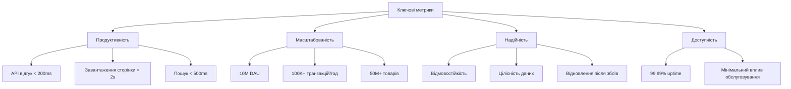

### Ідентифікація потенційних вузьких місць

1. **База даних:**
   - Читання каталогу товарів (50M записів)
   - Concurrent запити під час пікових навантажень
   - Консистентність даних при одночасному оновленні запасів

2. **Кешування:**
   - Популярні товари та категорії
   - Результати пошуку
   - Користувацькі сесії

3. **Мережа:**
   - CDN для статичного контенту
   - Географічна дистрибуція

4. **Обробка замовлень:**
   - Atomic операції (інвентар, платежі)
   - Черги повідомлень для асинхронної обробки

5. **Пошук:**
   - Індексація 50M товарів
   - Real-time оновлення індексів

---

## Високорівнева архітектура

### Архітектурний підхід

Обираємо **мікросервісну архітектуру** з наступних причин:
- Незалежне масштабування компонентів
- Технологічна різноманітність
- Ізоляція помилок
- Незалежна розробка командами

### Основні компоненти системи

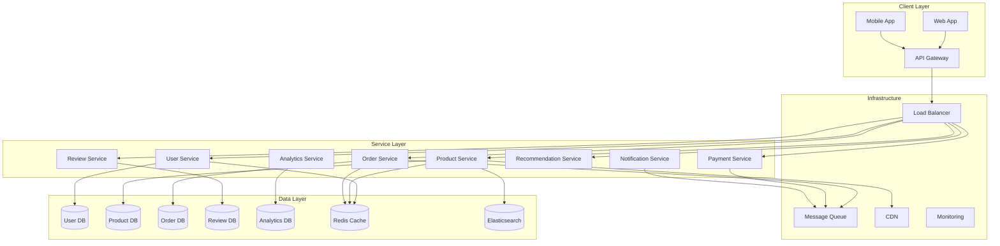

### Опис основних компонентів

1. **API Gateway**
   - Єдина точка входу для всіх клієнтів
   - Аутентифікація та авторизація
   - Rate limiting та throttling
   - Request/response transformation

2. **User Service**
   - Управління користувачами
   - Аутентифікація та авторизація
   - Профілі користувачів
   - Система ролей

3. **Product Service**
   - Каталог товарів
   - Категоризація
   - Управління інвентарем
   - Інтеграція з пошуковою системою

4. **Order Service**
   - Обробка замовлень
   - Управління кошиком
   - Відстеження статусу
   - Інтеграція з платіжними системами

5. **Payment Service**
   - Обробка платежів
   - Інтеграція з зовнішніми платіжними системами
   - Fraud detection
   - Refunds та chargebacks

6. **Review Service**
   - Система відгуків та рейтингів
   - Модерація контенту
   - Аналітика відгуків

7. **Recommendation Service**
   - Персоналізовані рекомендації
   - Collaborative filtering
   - Content-based filtering
   - Real-time рекомендації

### Обґрунтування архітектурного підходу

**Переваги мікросервісної архітектури:**
- **Масштабованість:** Кожен сервіс може масштабуватися незалежно
- **Технологічна свобода:** Різні сервіси можуть використовувати різні технології
- **Відмовостійкість:** Помилка в одному сервісі не впливає на інші
- **Швидкість розробки:** Команди можуть працювати незалежно

**Недоліки та міtigації:**
- **Складність:** Використання service mesh (Istio) для управління комунікацією
- **Consistency:** Eventual consistency з compensation patterns
- **Monitoring:** Централізований моніторинг та логування

---

## Детальний дизайн ключових компонентів

### API дизайн

#### 1. User Management API

```yaml
# Аутентифікація користувача
POST /api/v1/auth/login
Request:
  {
    "email": "user@example.com",
    "password": "password123"
  }
Response:
  {
    "access_token": "jwt_token",
    "refresh_token": "refresh_token",
    "user": {
      "id": "123",
      "email": "user@example.com",
      "role": "customer"
    }
  }

# Отримання профілю користувача
GET /api/v1/users/{user_id}
Response:
  {
    "id": "123",
    "email": "user@example.com",
    "name": "John Doe",
    "phone": "+1234567890",
    "addresses": [...]
  }
```

#### 2. Product Catalog API

```yaml
# Пошук товарів
GET /api/v1/products/search?q={query}&category={category}&page={page}&limit={limit}
Response:
  {
    "products": [
      {
        "id": "prod_123",
        "name": "Product Name",
        "price": 29.99,
        "currency": "USD",
        "category": "Electronics",
        "rating": 4.5,
        "reviews_count": 150,
        "image_url": "https://cdn.example.com/image.jpg"
      }
    ],
    "total": 1000,
    "page": 1,
    "limit": 20
  }

# Детальна інформація про товар
GET /api/v1/products/{product_id}
Response:
  {
    "id": "prod_123",
    "name": "Product Name",
    "description": "Product description",
    "price": 29.99,
    "currency": "USD",
    "stock_quantity": 100,
    "seller": {
      "id": "seller_456",
      "name": "Seller Name",
      "rating": 4.8
    },
    "specifications": {...},
    "images": [...]
  }
```

#### 3. Shopping Cart API

```yaml
# Додавання товару до кошика
POST /api/v1/cart/items
Request:
  {
    "product_id": "prod_123",
    "quantity": 2,
    "selected_variant": "red_large"
  }
Response:
  {
    "item_id": "cart_item_789",
    "product_id": "prod_123",
    "quantity": 2,
    "unit_price": 29.99,
    "total_price": 59.98
  }

# Оформлення замовлення
POST /api/v1/orders
Request:
  {
    "items": [
      {
        "product_id": "prod_123",
        "quantity": 2,
        "unit_price": 29.99
      }
    ],
    "shipping_address": {...},
    "payment_method": "card_ending_1234"
  }
Response:
  {
    "order_id": "order_456",
    "status": "pending",
    "total_amount": 59.98,
    "estimated_delivery": "2025-11-01"
  }
```

#### 4. Order Management API

```yaml
# Отримання історії замовлень
GET /api/v1/orders?user_id={user_id}&status={status}
Response:
  {
    "orders": [
      {
        "id": "order_456",
        "created_at": "2025-10-26T10:00:00Z",
        "status": "shipped",
        "total_amount": 59.98,
        "items_count": 2,
        "tracking_number": "TRACK123"
      }
    ]
  }

# Відстеження замовлення
GET /api/v1/orders/{order_id}/tracking
Response:
  {
    "order_id": "order_456",
    "status": "shipped",
    "tracking_events": [
      {
        "timestamp": "2025-10-26T10:00:00Z",
        "status": "order_placed",
        "location": "Warehouse"
      },
      {
        "timestamp": "2025-10-26T14:00:00Z",
        "status": "shipped",
        "location": "Distribution Center"
      }
    ]
  }
```

### Схеми баз даних

#### 1. User Database Schema

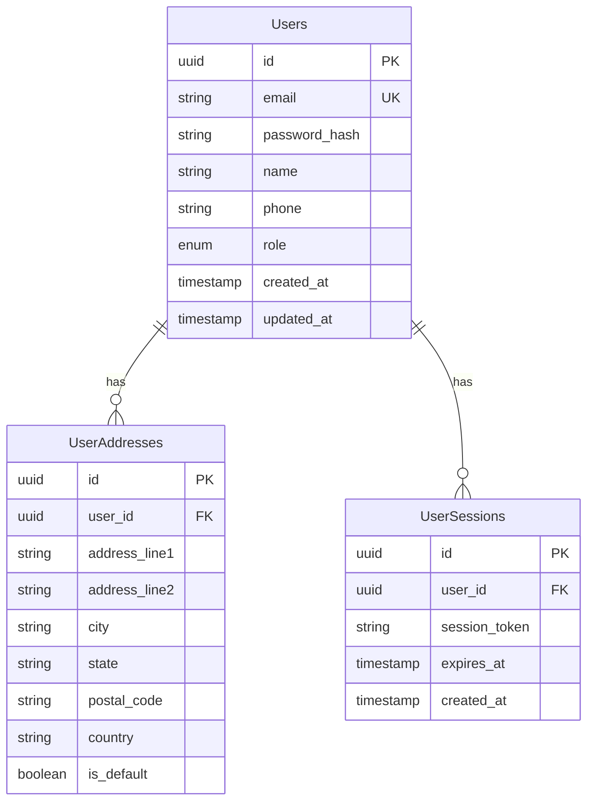

#### 2. Product Database Schema

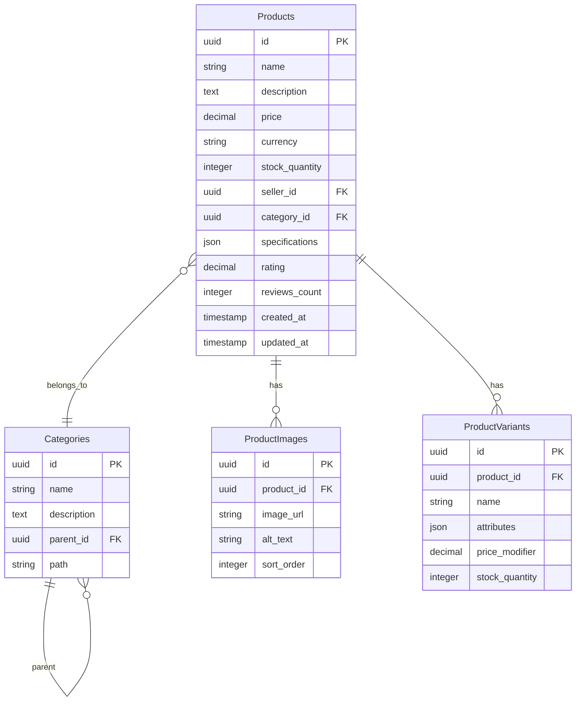

#### 3. Order Database Schema

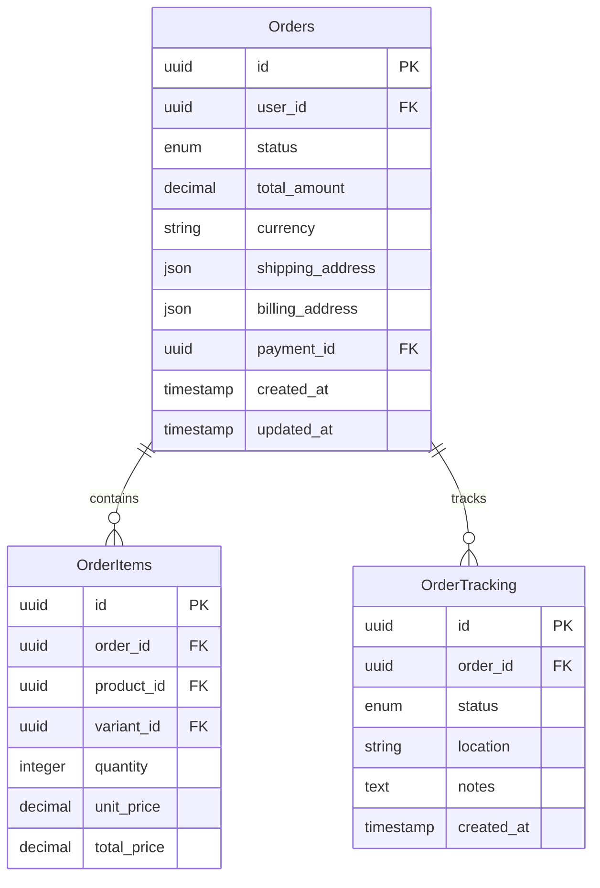

#### 4. Review Database Schema

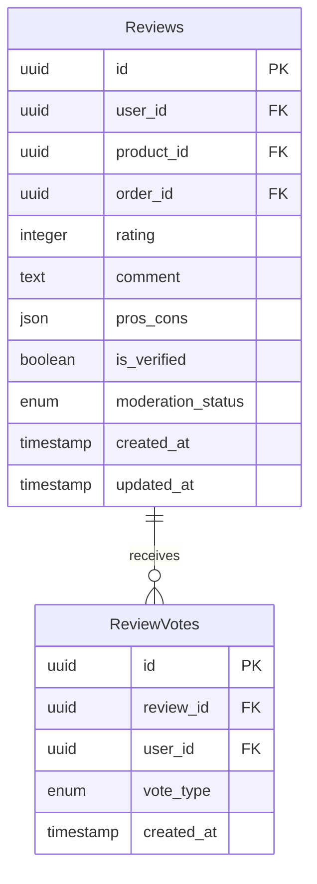

### Комунікація між компонентами

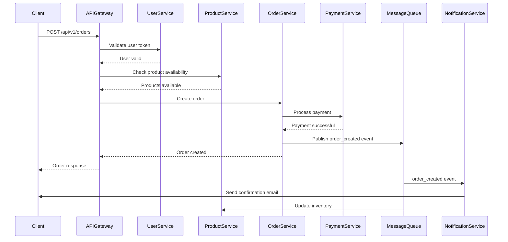

---

## Стратегії забезпечення надійності та відмовостійкості

### Реплікація та шардування даних

#### Стратегія шардування

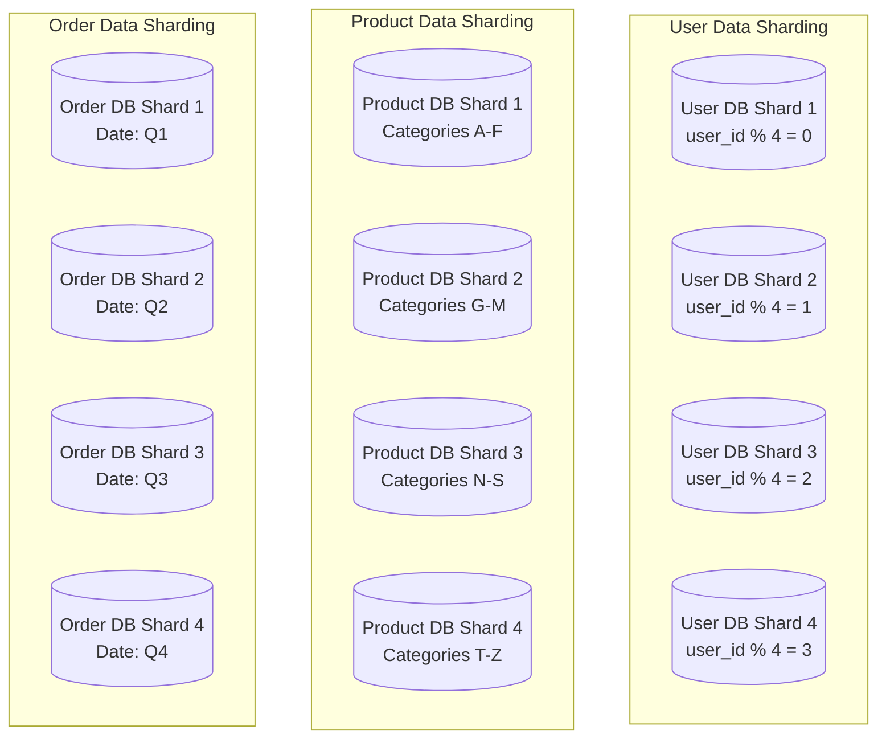

**Шардування користувачів:**
- Стратегія: Hash-based по user_id
- Переваги: Рівномірний розподіл навантаження
- Недоліки: Складність cross-shard запитів

**Шардування товарів:**
- Стратегія: По категоріях товарів
- Переваги: Локальність даних для пошуку
- Недоліки: Можливий нерівномірний розподіл

**Шардування замовлень:**
- Стратегія: По даті створення (time-based)
- Переваги: Ефективне архівування старих даних
- Недоліки: Hot shards для поточного періоду

#### Реплікація даних

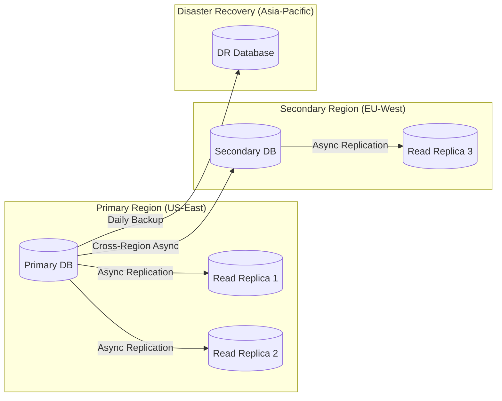

### Механізми обробки відмов

#### Circuit Breaker Pattern

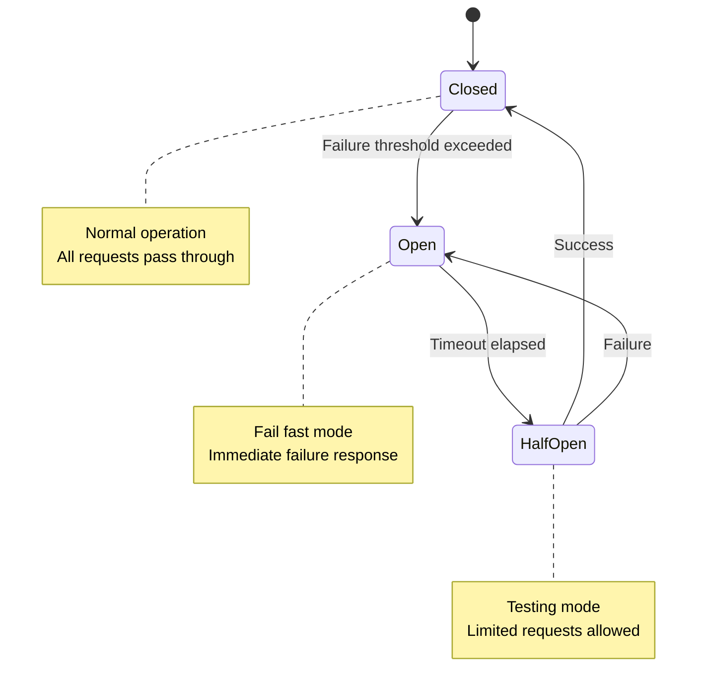

#### Retry Strategy з Exponential Backoff

```
Retry attempt 1: Wait 1s
Retry attempt 2: Wait 2s  
Retry attempt 3: Wait 4s
Retry attempt 4: Wait 8s
Maximum retries: 5
Maximum wait time: 30s
```

#### Bulkhead Pattern

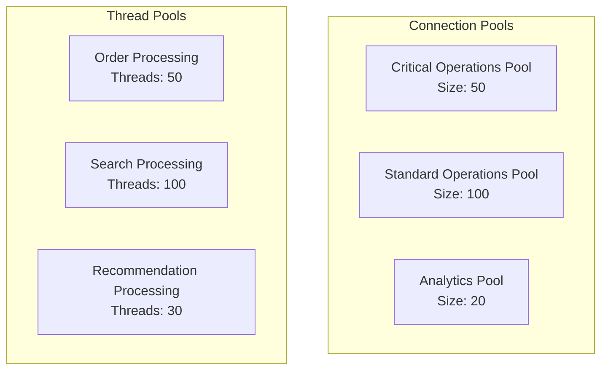

### Стратегії відновлення після збоїв

#### Disaster Recovery Plan

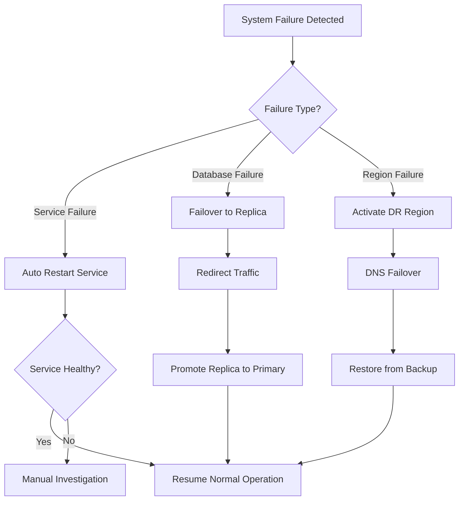

**Recovery Time Objectives (RTO):**
- Service failures: < 5 minutes
- Database failures: < 15 minutes
- Regional failures: < 30 minutes

**Recovery Point Objectives (RPO):**
- Critical data (orders, payments): < 1 minute
- User data: < 5 minutes
- Analytics data: < 1 hour

#### Data Consistency Strategies

**Eventual Consistency Model:**
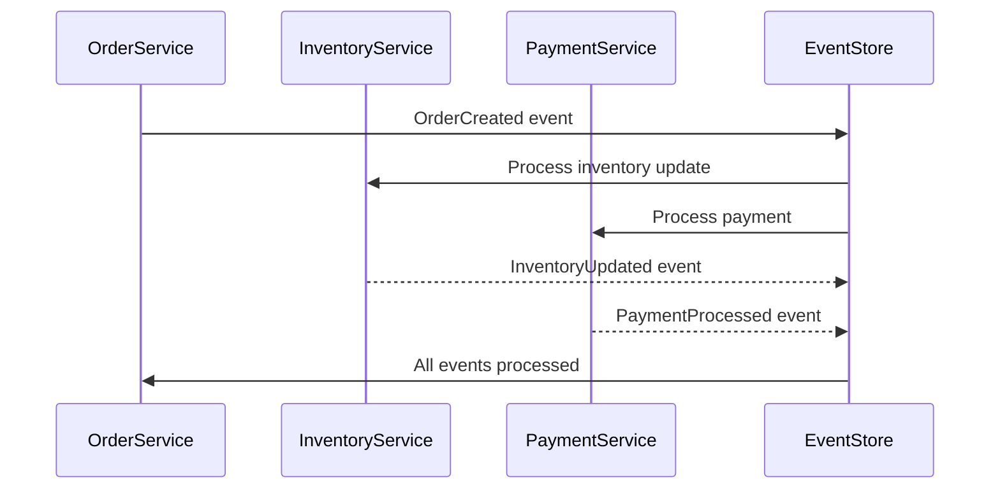

**Saga Pattern для розподілених транзакцій:**
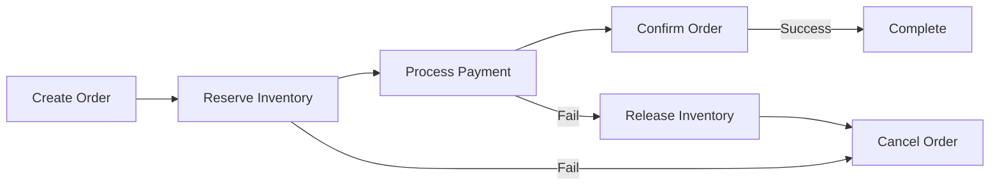

---

## Підходи до масштабування

### Горизонтальне масштабування

#### Auto-scaling стратегії

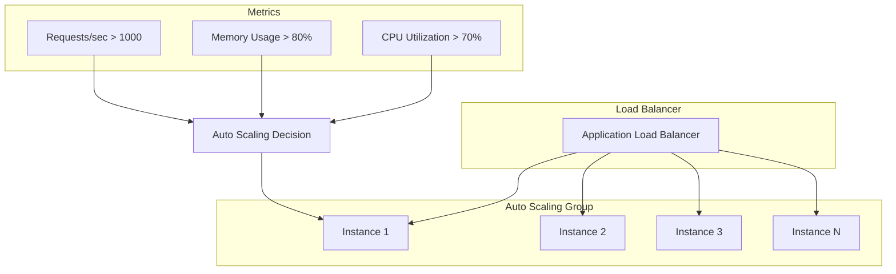

**Масштабування по метриках:**
- CPU utilization > 70% → Scale out
- Memory usage > 80% → Scale out
- Request rate > 1000 req/sec → Scale out
- Response time > 500ms → Scale out

#### Мікросервісне масштабування

```yaml
# Kubernetes Deployment Configuration
apiVersion: apps/v1
kind: Deployment
metadata:
  name: product-service
spec:
  replicas: 10
  selector:
    matchLabels:
      app: product-service
  template:
    spec:
      containers:
      - name: product-service
        image: product-service:v1.0
        resources:
          requests:
            memory: "256Mi"
            cpu: "250m"
          limits:
            memory: "512Mi"
            cpu: "500m"
---
apiVersion: autoscaling/v2
kind: HorizontalPodAutoscaler
metadata:
  name: product-service-hpa
spec:
  scaleTargetRef:
    apiVersion: apps/v1
    kind: Deployment
    name: product-service
  minReplicas: 5
  maxReplicas: 50
  metrics:
  - type: Resource
    resource:
      name: cpu
      target:
        type: Utilization
        averageUtilization: 70
```

### Вертикальне масштабування

**Стратегія вертикального масштабування:**
- Database servers: Up to 64 cores, 512GB RAM
- Cache servers: Up to 32 cores, 256GB RAM  
- Application servers: Up to 16 cores, 64GB RAM

### Обробка пікових навантажень

#### Black Friday / Cyber Monday стратегія

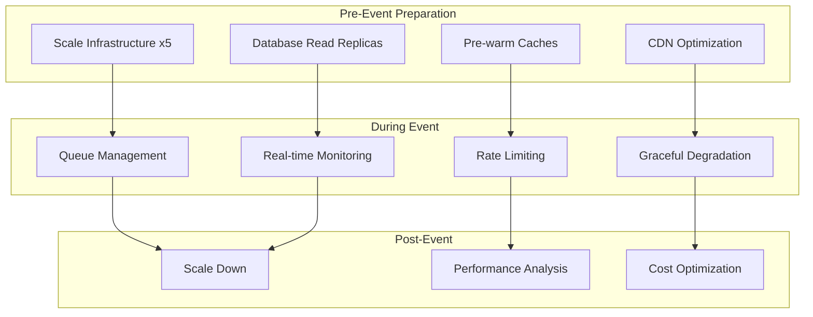

**Стратегії для пікових навантажень:**

1. **Попереднє масштабування:**
   - Збільшення кількості інстансів на 500%
   - Pre-warming кешів популярними товарами
   - Збільшення пропускної здатності CDN

2. **Черги та обмеження швидкості:**
   - Virtual waiting rooms для checkout процесу
   - Rate limiting per user: 100 requests/minute
   - Priority queuing для VIP користувачів

3. **Graceful degradation:**
   - Відключення неесенційних функцій (рекомендації)
   - Спрощення UI
   - Кешування статичних відповідей

### Оптимізація продуктивності

#### Стратегії кешування

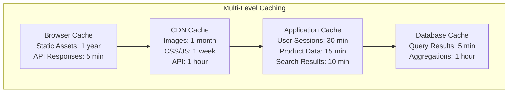

**Кешування по рівнях:**

1. **Browser Cache:**
   - Static assets: 1 рік
   - API responses: 5 хвилин
   - User-specific data: Session storage

2. **CDN Cache:**
   - Images: 1 місяць
   - CSS/JS: 1 тиждень  
   - API responses: 1 година

3. **Application Cache (Redis):**
   - User sessions: 30 хвилин
   - Product data: 15 хвилин
   - Search results: 10 хвилин

4. **Database Cache:**
   - Query results: 5 хвилин
   - Aggregated data: 1 година

#### Database Optimization

**Індексування стратегії:**
```sql
-- Товари: композитний індекс для пошуку
CREATE INDEX idx_products_category_price ON products (category_id, price, created_at);

-- Замовлення: індекс для користувача та статусу
CREATE INDEX idx_orders_user_status ON orders (user_id, status, created_at);

-- Відгуки: індекс для товару та рейтингу  
CREATE INDEX idx_reviews_product_rating ON reviews (product_id, rating, created_at);

-- Пошук: повнотекстовий індекс
CREATE FULLTEXT INDEX idx_products_search ON products (name, description);
```

**Connection Pooling:**
```yaml
database:
  pool_size: 20
  max_overflow: 30
  pool_timeout: 30
  pool_recycle: 3600
  pool_pre_ping: true
```

#### Асинхронна обробка

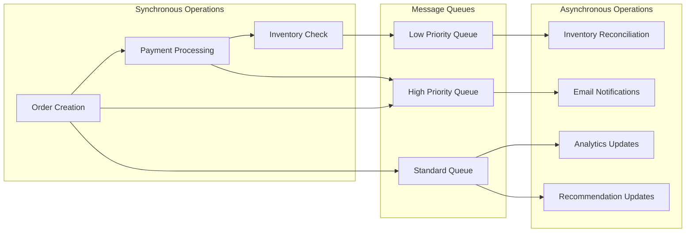

---

## Аналіз компромісів

### Обґрунтування архітектурних рішень

#### 1. Мікросервісі vs Монолітна архітектура

**Обране рішення: Мікросервіси**

| Критерій | Мікросервіси | Монолітна |
|----------|--------------|-----------|
| Масштабованість | ✅ Незалежне масштабування | ❌ Масштабування всієї системи |
| Складність розгортання | ❌ Висока | ✅ Низька |
| Технологічна різноманітність | ✅ Можлива | ❌ Обмежена |
| Час розробки | ❌ Повільніший старт | ✅ Швидший старт |
| Відмовостійкість | ✅ Ізоляція помилок | ❌ Single point of failure |

**Обґрунтування:** Для платформи е-commerce масштабу Amazon критично важливими є масштабованість та відмовостійкість, що переважує над складністю розгортання.

#### 2. SQL vs NoSQL для різних компонентів

**User Service - PostgreSQL (SQL)**
- **Переваги:** ACID транзакції, складні запити, консистентність
- **Недоліки:** Складніше масштабування
- **Альтернатива:** MongoDB - краща горизонтальна масштабованість, але слабша консистентність

**Product Catalog - Elasticsearch + PostgreSQL (Hybrid)**
- **Переваги:** Швидкий пошук + реляційна структура
- **Недоліки:** Складність синхронізації
- **Альтернатива:** Тільки PostgreSQL з повнотекстовим пошуком - простіше, але повільніший пошук

**Analytics - ClickHouse (Columnar)**
- **Переваги:** Оптимізація для аналітичних запитів
- **Недоліки:** Не підходить для OLTP
- **Альтернатива:** PostgreSQL - універсальність, але повільніша аналітика

#### 3. Синхронна vs Асинхронна комунікація

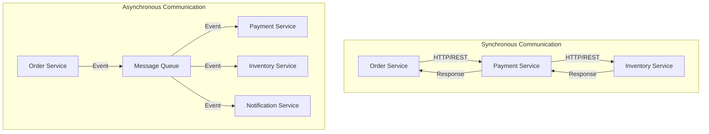

**Обране рішення: Гібридний підхід**

| Операція | Тип комунікації | Обґрунтування |
|----------|----------------|---------------|
| Order Creation | Синхронна | Потрібна негайна відповідь |
| Payment Processing | Синхронна | Критично для UX |
| Email Notifications | Асинхронна | Не блокує основний флоу |
| Analytics Updates | Асинхронна | Eventual consistency допустима |

#### 4. Кешування стратегії

**Cache-Aside vs Write-Through vs Write-Behind**

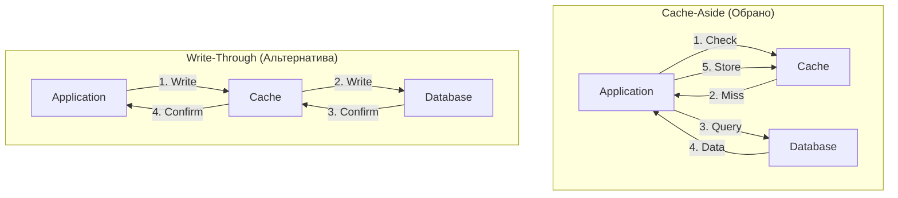

**Обране рішення: Cache-Aside**
- **Переваги:** Контроль над кешуванням, відмовостійкість
- **Недоліки:** Складність логіки в додатку
- **Альтернатива:** Write-Through - простіше, але більше навантаження на кеш

### Аналіз компромісів між властивостями системи

#### CAP Theorem застосування

```mermaid
triangle CAP
    A[Consistency] --> B[Availability]
    B --> C[Partition Tolerance]
    C --> A
    
    style A fill:#ff9999
    style B fill:#99ff99
    style C fill:#9999ff
```

**Наш вибір: AP (Availability + Partition Tolerance)**

| Компонент | CAP вибір | Обґрунтування |
|-----------|-----------|---------------|
| User Service | CP | Критична консистентність профілів |
| Product Catalog | AP | Доступність важливіша за свіжість даних |
| Order Service | CP | Консистентність замовлень критична |
| Analytics | AP | Eventual consistency прийнятна |

#### Консистентність vs Продуктивність

```mermaid
graph LR
    subgraph "Strong Consistency"
        A1[Synchronous Replication]
        A2[Higher Latency]
        A3[ACID Transactions]
    end
    
    subgraph "Eventual Consistency"
        B1[Asynchronous Replication]
        B2[Lower Latency]
        B3[BASE Properties]
    end
    
    A1 --> A2
    A2 --> A3
    
    B1 --> B2
    B2 --> B3
```

**Компроміси по компонентах:**

1. **Платежі:** Strong consistency - фінансові дані
2. **Каталог товарів:** Eventual consistency - швидкість пошуку
3. **Користувацькі профілі:** Strong consistency - безпека
4. **Рекомендації:** Eventual consistency - performance

### Оцінка альтернативних підходів

#### Альтернатива 1: Serverless архітектура

```mermaid
graph TB
    subgraph "Serverless Alternative"
        API[API Gateway]
        L1[Lambda: User Management]
        L2[Lambda: Product Search]
        L3[Lambda: Order Processing]
        DDB[(DynamoDB)]
        S3[(S3 Storage)]
    end
    
    API --> L1
    API --> L2
    API --> L3
    L1 --> DDB
    L2 --> DDB
    L3 --> DDB
    L2 --> S3
```

**Переваги Serverless:**
- Автоматичне масштабування
- Pay-per-use модель
- Менше операційних витрат

**Недоліки Serverless:**
- Cold start latency
- Vendor lock-in
- Складність debugging

**Висновок:** Не підходить для high-traffic е-commerce через latency та cost при великому навантаженні.

#### Альтернатива 2: Event Sourcing архітектура

```mermaid
graph TB
    subgraph "Event Sourcing Alternative"
        CMD[Command Handler]
        ES[Event Store]
        PROJ1[Read Model 1]
        PROJ2[Read Model 2]
        PROJ3[Read Model 3]
    end
    
    CMD -->|Events| ES
    ES -->|Replay| PROJ1
    ES -->|Replay| PROJ2
    ES -->|Replay| PROJ3
```

**Переваги Event Sourcing:**
- Повний audit trail
- Можливість replay подій
- Temporal queries

**Недоліки Event Sourcing:**
- Складність запитів
- Великий обсяг даних
- Складність eventual consistency

**Висновок:** Підходить для критичних компонентів (замовлення, платежі), але не для всієї системи.

### Рекомендації для реалізації

1. **Поетапна міграція:**
   - Почати з монолітної архітектури
   - Поступово виділяти мікросервіси
   - Використовувати strangler fig pattern

2. **Технологічний стек:**
   - Backend: Java/Spring Boot або Go
   - Databases: PostgreSQL + Redis + Elasticsearch
   - Message Queue: Apache Kafka
   - Container orchestration: Kubernetes

3. **Моніторинг та обсервабельність:**
   - Distributed tracing (Jaeger)
   - Metrics (Prometheus + Grafana)
   - Logging (ELK Stack)
   - APM (New Relic або DataDog)

4. **Безпека:**
   - OAuth 2.0 + JWT токени
   - API rate limiting
   - Input validation та sanitization
   - WAF (Web Application Firewall)

5. **DevOps practices:**
   - GitOps для deployment
   - Blue-green deployments
   - Automated testing pipeline
   - Infrastructure as Code (Terraform)

---

## Висновки

Спроєктована архітектура масштабованої платформи електронної комерції забезпечує:

1. **Масштабованість:** Підтримка 10M DAU та 100K+ транзакцій/година
2. **Надійність:** 99.99% доступність із вбудованими механізмами відмовостійкості
3. **Продуктивність:** < 200ms API відгук та < 2s завантаження сторінки
4. **Гнучкість:** Мікросервісна архітектура дозволяє незалежний розвиток компонентів

Ключові архітектурні рішення обґрунтовані аналізом компромісів між консистентністю, доступністю та продуктивністю, що робить систему готовою для real-world deployment у масштабах великих е-commerce платформ.